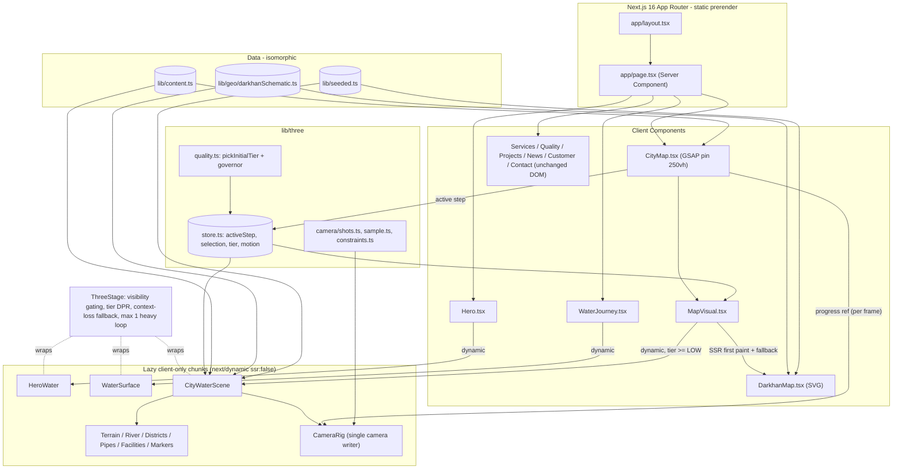

# PROJECT 3D MASTER PLAN

| Field | Value |
| --- | --- |
| Project name | Дархан Ус Суваг — website (npm package `darkhan-us-suvag`, v0.1.0) |
| Organization represented | Дархан Ус Суваг ОНӨААТҮГ (source: `package.json` description, `app/layout.tsx` metadata, logo alt text in `components/ui/Logo.tsx`, footer in `components/sections/Contact.tsx`). Legal form / official English name: **NEEDS CONFIRMATION** |
| Document version | 1.0, a draft for approval |
| Date | 2026-09-30 |
| Repository status | **Not a git repository** (no history, no branches). `npm run lint` (`tsc --noEmit`) passes with 0 errors. `next build` passes and produces one static route `/`. `node_modules/` and `.next/` exist locally because an earlier analysis step in the same session ran `npm install` and `next build`, before the "do not install dependencies" instruction was given. That `npm install` **rewrote `package-lock.json`** (68,091 → 68,191 bytes, mtime 2026-09-30 16:54 +08:00). The build and typecheck also generated `next-env.d.ts` and `tsconfig.tsbuildinfo`, both of which are git-ignored. `package.json` and all source files are unchanged. |
| Current framework | Next.js 16.3.6 (App Router, Turbopack build), React 19.3.0, TypeScript 5.9.3 (strict), Tailwind CSS 4.3.3 |
| Current architecture summary | Statically prerendered single-page site at `/`. It has 9 client-side section components and 4 global client utilities, all under a Server Component page (`app/page.tsx`). All copy and figures live in one typed module (`lib/content.ts`). There are already **two React Three Fiber (R3F) canvases** with custom GLSL shaders: the hero water and a background caustic surface. GSAP ScrollTrigger and Lenis handle scroll choreography, and Framer Motion handles DOM UI transitions. There is no backend, API route, CMS, or third-party runtime service. |
| Purpose of this document | Give a senior developer or AI coding agent, with **zero access to the originating conversation**, a verified picture of the current repository and one recommended, incremental plan for turning it into a premium, cinematic 3D public-infrastructure website. 3D is treated strictly as progressive enhancement. |

**Conventions used in this document**

- **CURRENT** = verified in the repository as of 2026-09-30. **PROPOSED** = recommendation, not implemented.
- **NEEDS CONFIRMATION** = a decision or fact the repository cannot answer. **NEEDS REAL DATA** = content is a placeholder or missing. **NEEDS ASSET** = a file (image, model, vector) that does not exist.
- File references use repo-relative paths, e.g. `components/sections/CityMap.tsx:105`.
- Line counts come from `wc -l` on 2026-09-30.

---

## 1. Current Project Summary

**CURRENT.** This is the public website of Darkhan city's water supply and sewerage organization. It is written entirely in Mongolian (`<html lang="mn">` in `app/layout.tsx`). `README.md` states the concept as a "water journey storytelling website":

> УС ЭХЭЛНЭ → ЦЭВЭРШИНЭ → ХОТ РУУ ХҮРНЭ → ХҮМҮҮС ХЭРЭГЛЭНЭ → БОХИР УС БУЦНА → БИД ЦЭВЭРШҮҮЛНЭ → ДАХИН ЭХЭЛНЭ
> (water begins → is purified → reaches the city → people use it → wastewater returns → we treat it → it begins again)

The site is one long scrolling page:

1. A light, WebGL-rendered water surface. The words "ДАРХАН ХОТ" appear under the water. Scrolling "dives" through the surface into a dark, deep-water theme, which the rest of the site uses.
2. A horizontal "water journey" through 6 stages, from source to home.
3. The organization's three activities: water supply, sewerage, treatment.
4. Water quality statistics and parameters.
5. A pinned, scroll-driven **schematic** SVG map of Darkhan's water system. It is explicitly not geographically accurate (`components/sections/CityMap.tsx:267`).
6. Infrastructure projects with a detail modal.
7. News with category filters.
8. Online customer services and a request form.
9. Contact details, a 24/7 emergency call card, and the footer.

Global overlays: a navbar with a centered logo and scroll-progress ring, an "outage now" banner, a refracting water-drop mouse cursor, and Lenis smooth scrolling.

**Maturity: pre-launch front-end prototype.**

- Many figures are placeholders (`XX,XXX`, `XXXX-XXXX`) and are marked `// TODO` in `lib/content.ts`.
- The request form does not submit anywhere.
- The language switch and news links are non-functional.

See §9.

---

## 2. Current Tech Stack

Everything below was verified in `package.json` and in `node_modules/*/package.json`.

| Technology | Declared | Installed | Where it is actually used |
| --- | --- | --- | --- |
| Next.js | `^16.3.6` | 16.3.6 | App Router (`app/`); `next/font/google` (Ubuntu); `next/image` (`components/ui/Logo.tsx`, uses the v16 `preload` prop); `next/dynamic` with `ssr:false` (`Hero.tsx:10`, `WaterJourney.tsx:22`) |
| React / React DOM | `~19.3.0` | 19.3.0 | Everywhere |
| TypeScript | `^5.9` | 5.9.3 | `strict: true`, path alias `@/*` → `./*` (`tsconfig.json`) |
| Tailwind CSS (+ `@tailwindcss/postcss`) | `^4.3.3` | 4.3.3 | CSS-first config through `@theme` in `app/globals.css`. There is no `tailwind.config.*`. PostCSS config: `postcss.config.mjs` |
| three | `^0.186.1` | 0.186.1 | `components/three/HeroWater.tsx` (ShaderMaterial, HalfFloat WebGLRenderTarget ping-pong, CanvasTexture); `components/three/WaterSurface.tsx` |
| @react-three/fiber | `^9.8.1` | 9.8.1 | `Canvas`, `useFrame`, `useThree` in the two files above |
| GSAP (+ ScrollTrigger) | `^3.15.0` | 3.15.0 | `SmoothScroll.tsx`, `Hero.tsx`, `WaterJourney.tsx`, `Services.tsx`, `CityMap.tsx`, `journey/Visuals.tsx`, `journey/DripDots.tsx` |
| Lenis | `^1.3.26` | 1.3.26 | `components/SmoothScroll.tsx` (synced to the GSAP ticker; anchor clicks routed through `lenis.scrollTo`) |
| framer-motion | `^13.4.4` | 13.4.4 | `SectionHeading`, `Navbar`, `OutageBanner`, `CityMap`, `Projects`, `News`, `WaterQuality`, `CustomerServices`, `Contact` |
| @types/node, @types/react, @types/react-dom, @types/three | dev | installed | Types only |

**Not present:**

- `@react-three/drei` and `postprocessing`.
- Any map library (Cesium, MapLibre, Mapbox, Leaflet).
- Any icon library (all icons are inline SVG).
- Any direct state library. `zustand` 5.0.15 exists **only transitively** as a dependency of `@react-three/fiber` and must not be imported unless it is added as a direct dependency.
- Any CMS SDK, analytics, test runner, ESLint, or Prettier. The `lint` script is `tsc --noEmit`.

Some files contain `eslint-disable` comments (e.g. `WaterJourney.tsx:88`), but ESLint is not installed.

**External services:** Google Fonts through `next/font` only. The font is downloaded at build time and self-hosted. No runtime third-party requests were detected. The only outbound links are `tel:` and `mailto:`.

**Browser features relied on:**

- WebGL through three.js.
- `IntersectionObserver`, `matchMedia`, `document.fonts`, `requestAnimationFrame`.
- The Web Animations API (`Element.animate`).
- CSS `@property`.
- CSS `backdrop-filter: url(#svg-filter)`. This is a Chromium-only effect in `DropCursor`.
- SVG SMIL `<animate>` (`Contact.tsx:75,83`).

**Tooling on the analysis machine:** Node v24.12.0 and npm 11.6.2. Deployment target and Node version: **NEEDS CONFIRMATION**.

---

## 3. Existing Repository Architecture

```
./
├── AGENTS.md              Next.js agent rules (auto-managed by `next dev`; do not edit)
├── CLAUDE.md              "@AGENTS.md" include only
├── README.md              Mongolian project readme (stack, structure, content workflow, next steps)
├── package.json / package-lock.json
├── next.config.ts         { reactStrictMode: true } — nothing else
├── tsconfig.json          strict, bundler resolution, "@/*" alias, includes **/*.ts(x)
├── postcss.config.mjs     "@tailwindcss/postcss"
├── .gitignore             node_modules, .next, out, next-env.d.ts, *.tsbuildinfo, .env*.local, .DS_Store
├── .claude/settings.local.json   local agent permissions (references another machine's user path; harmless)
├── app/
│   ├── layout.tsx (29)    <html lang="mn">, Ubuntu font (300/400/500/700; latin, cyrillic, cyrillic-ext), metadata, viewport themeColor
│   ├── page.tsx (35)      Server Component composing all sections + overlays
│   ├── globals.css (626)  Tailwind v4 @theme tokens, dark/light token override, all custom CSS (hero, journey, navbar, cursor, keyframes)
│   ├── icon.png           64×64 favicon (metadata file route)
│   └── apple-icon.png     180×180 (metadata file route)
├── components/
│   ├── SmoothScroll.tsx (42)   Lenis ↔ GSAP ScrollTrigger sync, anchor interception
│   ├── Navbar.tsx (288)        desktop split nav + centered logo + scroll ring, LangSwitch (non-functional), MobileMenu dialog
│   ├── OutageBanner.tsx (87)   fixed bottom-right outage card / pill
│   ├── DropCursor.tsx (276)    custom refracting water-drop cursor + click splash (fine pointers only)
│   ├── three/
│   │   ├── HeroWater.tsx (482)     hero WebGL: wave-equation ripple sim, caustics, under-water title, dive sequence
│   │   └── WaterSurface.tsx (122)  faint caustic background for WaterJourney
│   ├── sections/
│   │   ├── Hero.tsx (123)               "01" hero, sticky 200svh dive track
│   │   ├── WaterJourney.tsx (304)       "02" horizontal 6-stage journey
│   │   ├── journey/Visuals.tsx (360)    6 scroll-scrubbed SVG stage visuals + ScrubDriver context
│   │   ├── journey/DripDots.tsx (97)    stage pagination with hopping drop
│   │   ├── Services.tsx (148)           "03" activities (zig-zag rows)
│   │   ├── services/Illustrations.tsx (220)  3 SVG illustrations
│   │   ├── WaterQuality.tsx (129)       "04" counters + parameter tabs
│   │   ├── CityMap.tsx (272)            "05" pinned schematic map with CSS "camera"
│   │   ├── map/DarkhanMap.tsx (184)     SVG schematic (1600×900 coordinate space)
│   │   ├── Projects.tsx (136)           "06" project cards + modal
│   │   ├── News.tsx (153)               "07" filtered news grid
│   │   ├── news/NewsCover.tsx (61)      generated SVG covers per news kind
│   │   ├── CustomerServices.tsx (139)   "✦" service tiles + request form
│   │   └── Contact.tsx (110)            "08" contact + emergency + footer (rendered as <footer>)
│   └── ui/
│       ├── Logo.tsx (27)           LogoMark (next/image of /logo.png) + text logo
│       └── SectionHeading.tsx (33) eyebrow/title/lead with Framer reveal
├── lib/
│   ├── content.ts (382)   ALL content: nav, contact, outages, journey, services, qualityStats, qualityParams, cityFlow, projects, news, customerServices, requestTypes (+ types)
│   └── seeded.ts (8)      deterministic PRNG (Park–Miller) for SSR-stable procedural SVG
└── public/
    └── logo.png           512×512 RGBA PNG, 485,136 bytes
```

**Responsibilities and observations**

- **`app/`**: routing shell only. `page.tsx` is a Server Component, but every section it renders is a Client Component (`"use client"` in 18 files). The only components without the directive are `layout.tsx`, `page.tsx`, and four modules imported only by client parents (`Logo.tsx`, `DarkhanMap.tsx`, `NewsCover.tsx`, `Illustrations.tsx`). Those four therefore also end up in the client bundle. All of them are still prerendered to HTML.
- **`lib/content.ts`**: a good single source of truth, typed with exported types (`JourneyStage`, `CityStep`, `Project`, `NewsKind`). It is static, so an outage update needs a code change plus a redeploy.
- **`components/three/`**: already the right home for WebGL. Both canvases are loaded with `next/dynamic({ ssr:false })` from client parents, gated by `IntersectionObserver`, and dispose GPU resources on unmount.

**Architectural issues**

1. **Duplicated GLSL.** `hash`/`noise`/`fbm`/`caustic` are duplicated between `HeroWater.tsx` and `WaterSurface.tsx`.
2. **Schematic geometry is private to `DarkhanMap.tsx`.** `RIVER`, `WELLS`, `WATER`, `SEWER` and `districts` (`DarkhanMap.tsx:25-48`) are not exported. The camera focus table `focus` (`CityMap.tsx:18`) is also private. A 3D scene needs both.
3. **Scroll state is scattered.** `Navbar.tsx` and `OutageBanner.tsx` each attach their own `window` scroll listeners. Hero, WaterJourney, Services and CityMap each own ScrollTriggers. There is no shared "active section" state.
4. **Three animation systems coexist.** These are GSAP, Framer Motion, and CSS/SMIL/WAAPI, plus Lenis. They have overlapping responsibilities, but the split is mostly consistent: GSAP handles scroll, Framer handles UI state.
5. **Hard-coded hex palettes** in SVG components (`Visuals.tsx` `W/INK/MIST/LINE/SURFACE`, `DarkhanMap.tsx`, `NewsCover.tsx`) duplicate the design tokens.
6. **Small helpers are duplicated.** `pad()` appears in `WaterJourney.tsx`, `CityMap.tsx` and `Navbar.tsx`. The water-drop SVG path appears in `Services.tsx`, `CityMap.tsx` and `Visuals.tsx`.
7. **No tests, no version control.**

---

## 4. Existing Routes and Pages

**CURRENT** (verified from `next build` output):

| Route | Page/component | Purpose | Current state | Reuse recommendation |
| --- | --- | --- | --- | --- |
| `/` | `app/page.tsx` (+ `app/layout.tsx`) | The whole website | Static (○), prerendered. All content is present in the SSR HTML (verified: e.g. "Хараа голын хөндийн", "MNS 0900:2018" appear in `.next/server/app/index.html`). | **Keep.** It remains the only public page during the 3D phases. |
| `/_not-found` | Next.js default | 404 | Default, unstyled | Keep. Optional: branded `app/not-found.tsx` later. |
| `/icon.png` | `app/icon.png` | Favicon | 64×64 | Keep |
| `/apple-icon.png` | `app/apple-icon.png` | iOS icon | 180×180 | Keep |

There are no API routes, route handlers, server actions, middleware/proxy, dynamic routes, `sitemap`, `robots`, `opengraph-image`, `not-found`, `loading` or `error` files.

**In-page anchors (the real information architecture):**

| Anchor | Element | Linked from |
| --- | --- | --- |
| `#top` | Hero `<section>` | Navbar "Нүүр", logo |
| `#journey` | WaterJourney | Navbar "Усны аялал" |
| `#stage-{source,extraction,treatment,reservoir,network,home}` | Scroll-position spans in the journey track | DripDots, side cards |
| `#services` | Services | Navbar "Бидний тухай" (label ≠ content, see §9) |
| `#quality` | WaterQuality | (not in the nav) |
| `#map` | CityMap | OutageBanner "Газрын зураг дээр харах" (not in the nav) |
| `#map-step-0…5` | Scroll-position spans in CityMap | Map pills |
| `#projects` | Projects | Navbar "Төсөл" |
| `#news` | News | Navbar "Мэдээ", and every news card (self-link) |
| `#customer` | CustomerServices | Navbar "Үйлчилгээ", Services "Дэлгэрэнгүй" |
| `#request` | Request form block | Customer service tiles |
| `#contact` | Footer | (not in the nav) |

---

## 5. Existing Homepage Breakdown

Order is from `app/page.tsx`: `SmoothScroll`, `Navbar`, then in `<main>`: Hero, WaterJourney, Services, WaterQuality, CityMap, Projects, News, CustomerServices. After `</main>`: Contact (footer), `OutageBanner`, `DropCursor`.

### 5.1 Hero — `components/sections/Hero.tsx` + `components/three/HeroWater.tsx`

| Aspect | CURRENT |
| --- | --- |
| Content | Eyebrow "УС БҮХНИЙ ЭХЛЭЛ", H1 "ДАРХАН ХОТ" (`aria-label="Дархан хот — Дархан Ус Суваг ОНӨААТҮГ"`). **No CTA, no lead text, no scroll cue.** |
| Visuals | Light theme (`.theme-light`), radial gradient `#e3f5fd → #a9dcf5 → #6fbde6`, grain. The WebGL layer is a wave-equation ripple simulation on ping-pong HalfFloat targets (320 or 200 texels wide), caustics, and the H1 redrawn into a `CanvasTexture` and refracted "under water". The dive has three phases: surface zoom, a break-through line, and underwater (light rays, bubbles, marine snow, sinking title). |
| Interactions | Pointer move creates ripples. Pointer down drops a big drop. Scroll drives the dive over a sticky `200svh` track (`Hero.tsx:82`). The dive progress passes to the shader through a ref (no React re-render). |
| Strengths | Progressive: the HTML title is shown until WebGL is ready, with a CSS failsafe at 4s (`.hero-pre`). Reduced motion gets a static path. The render loop stops off-screen and after the dive (`running={inView && !dived}`). DPR is capped `[1,1.5]`. |
| Weaknesses | 482-line file with 3 inline shaders. GLSL is duplicated with `WaterSurface.tsx`. There is no device-tier awareness. Window-level pointer listeners stay attached while mounted. No hero CTA. |
| Keep? | **Yes.** It is already a high-quality 3D/shader hero and the brand moment. |
| Could become 3D? | It already is. |
| PROPOSED | Hardening only (Phase 2): shared shader chunks, tier-aware DPR/sim size, WebGL context-loss fallback, and idle prefetch of the city scene. Optional scroll cue. **No rebuild.** |

### 5.2 Water Journey — `WaterJourney.tsx`, `journey/Visuals.tsx`, `journey/DripDots.tsx`, `three/WaterSurface.tsx`

| Aspect | CURRENT |
| --- | --- |
| Content | `journey` (6 stages): `label`, `title`, `lead`, `facts`. Most numeric facts are `TODO` placeholders. |
| Visuals | A sticky stage with a horizontally translating card row and a connecting "pipe" whose fill is clipped by progress. Each card has a glass panel, a scroll-scrubbed SVG visual (source terrain/aquifer, extraction pump, treatment clearing, reservoir level, network lighting, home), and a fact grid. The background is `WaterSurface` (R3F, `dpr={0.5}`, masked fixed layer, clipped to the section). During the hero overlap, the heading gets an SVG turbulence displacement filter. |
| Interactions | Vertical scroll becomes horizontal travel (`WaterJourney.tsx:112-130`). DripDots pagination animates a hopping drop. Clicking a side card jumps to its anchor. |
| Strengths | Content-first DOM, clear narrative, semantic `article`/`dl`. The `ScrubDriver` context lets visuals be driven by stage progress instead of scroll. |
| Weaknesses | **Very long pinned distance.** At 1440×900 the track is ≈ 5,320 px, about 5.9 viewports (estimated from the sizing code at `WaterJourney.tsx:95-101`, not measured in a browser). The height is JS-measured, so the initial style `calc(100svh + 450vw)` (`:215`) is replaced after measurement (`:101`), causing layout shift below the fold. The `WaterSurface` loop and the `HeroWater` loop can run simultaneously during the dive overlap. Many facts are placeholders. |
| Keep? | **Yes.** |
| Could become 3D? | Technically yes, but **not recommended**. It would duplicate the city scene's job and replace readable DOM cards with canvas content. |
| PROPOSED | Keep the DOM and SVG. Disable `WaterSurface` on the LOW tier. Optionally shorten the track per viewport (NEEDS CONFIRMATION from the stakeholder). |

### 5.3 Services — `Services.tsx`, `services/Illustrations.tsx`

| Aspect | CURRENT |
| --- | --- |
| Content | `services` (3): УС ХАНГАМЖ / АРИУТГАХ ТАТУУРГА / ЦЭВЭРЛЭХ БАЙГУУЛАМЖ, each with text, 3 points, and "Дэлгэрэнгүй →" (links to `#customer`). The text is marked "TODO: тайлбар, жагсаалтыг байгууллагаар баталгаажуулах". |
| Visuals / animation | Zig-zag rows, SVG illustrations (tap/glass, street cross-section, treatment), clip-path reveal, zoom, parallax, and outlined big numbers. Reduced-motion aware through `gsap.matchMedia`. |
| Weaknesses | "Дэлгэрэнгүй" goes to the generic customer section instead of anything service-specific. |
| Keep? / 3D? | **Keep. No 3D** (illustrations are light and on-brand). |
| PROPOSED | Optional: link each service to its map step (supply → `#map-step-0`, sewer/treatment → `#map-step-4`) so the 3D map becomes the "detail" view. |

### 5.4 Water Quality — `WaterQuality.tsx`

| Aspect | CURRENT |
| --- | --- |
| Content | `qualityStats` (24/7, 30+, 1200, 100% — the last 3 are TODO) and `qualityParams` (pH, turbidity, microbiology, residual chlorine, hardness, all TODO values). Footnote: "MNS 0900:2018". |
| Interactions | Counters animate on view. Parameter "tabs" drive a detail panel with a ratio bar. |
| Weaknesses | The "Стандартын шаардлага хангасан" badge is **hard-coded for every parameter**, independent of data. This is a content-integrity risk while values are placeholders. Tab semantics are incomplete (§9). |
| Keep? / 3D? | **Keep. No 3D.** Measurements must stay readable, crawlable text. |
| PROPOSED | Later, feed from real lab data (NEEDS REAL DATA) and derive the badge from `value` vs `norm`. |

### 5.5 City Map — `CityMap.tsx`, `map/DarkhanMap.tsx`  ⟵ **primary 3D candidate**

| Aspect | CURRENT |
| --- | --- |
| Content | `cityFlow` (6 steps: source, pump, reservoir, pipe, treatment, consumers) with text and facts (placeholders), `outages[0]`, a legend (clean water / sewer / repair), and a disclaimer that the schematic is not real geography (`CityMap.tsx:267`). |
| Visuals | SVG in a 1600×900 space. It includes: a grid; the Kharaa river path; 3 districts with procedurally generated buildings (`seeded()`); 4 wells; 2 pump stations; a reservoir; 2 treatment tanks; clean-water lines (blue `#38b6f0`) and a sewer line (green `#1fa37a`) drawn by `stroke-dashoffset`; and an outage marker (red `#ff5a6e`). |
| "Camera" | Already exists as data. `focus` (`CityMap.tsx:18-25`) gives each step a focus point in map pixels and a zoom `s` (1.7–1.9), or `null` for the overview. It is applied as a CSS transform with a 1600 ms transition. The screen-space offset is `--vx/--vy`: desktop `-0.26/0.06` (focus left of center), mobile `0.2/-0.08`. |
| Interactions | GSAP pin for 250 viewport-% (`PIN = 250`, `:13`). The active step is computed at `:105`. The spine fill and drop are scrubbed. Pills link to `#map-step-i`. The desktop card follows the active pill, and there is a mobile bottom card. |
| Strengths | Already structured as "shots + steps + fallback". Content comes from `lib/content.ts`. Semantic `<ol>` with `aria-current`. A disclaimer exists. |
| Weaknesses | Zooming a large SVG with CSS transforms is expensive to rasterize. Step changes are time-based (1600 ms) rather than scrubbed. The disclaimer is hidden below `lg` (`hidden … lg:block`). The schematic constants are private. |
| Keep? | **Keep the section, pills, cards, legend and disclaimer.** The SVG becomes the fallback. |
| Could become 3D? | **Yes. This is the flagship 3D scene** (§11, §14). |

### 5.6 Projects — `Projects.tsx`

| Aspect | CURRENT |
| --- | --- |
| Content | `projects` (3) with year, location, period, goal, investment (TODO), progress %, result. |
| Interactions | Card grid, a detail modal (`role="dialog"`, `:91`), Escape to close, and an image placeholder "ЗУРАГ" (`:108`). |
| Weaknesses | The modal does not move focus into itself, has no focus trap, and no explicit scroll lock (only `data-lenis-prevent`, `:88`). No images (NEEDS ASSET). |
| Keep? / 3D? | **Keep. No 3D.** Optional Phase 5: "show on map" for the project whose `location` matches a schematic district (only p1 "Хуучин Дархан" matches today). |

### 5.7 News — `News.tsx`, `news/NewsCover.tsx`

| Aspect | CURRENT |
| --- | --- |
| Content | `news` (6 items, TODO) with 4 kinds, one `urgent`. Generated covers per kind. |
| Interactions | Filter tabs (`role="tab"`, `:98`), a featured layout, and at most 5 visible items. |
| Weaknesses | Every card and "Унших →" links to `#news` itself (`:30`). There are no article pages. Content is static. |
| Keep? / 3D? | **Keep. No 3D.** |

### 5.8 Customer Services — `CustomerServices.tsx`

| Aspect | CURRENT |
| --- | --- |
| Content | 5 service tiles (payment check, meter, request, complaint, reference) and 4 request types. |
| Interactions | Tiles link to `#request`. Choosing a type shows the form, and submitting shows success. |
| Weaknesses | **The submit only sets `sent=true`** (`:89-92`, `// TODO: backend API холбох`). Personal data (name, phone, address) is collected in the UI with no privacy notice (NEEDS CONFIRMATION of data-protection requirements). 3 of the 5 tiles have no matching flow. |
| Keep? / 3D? | **Keep. Never 3D.** Forms must stay plain, accessible DOM. |

### 5.9 Contact / Footer — `Contact.tsx`

| Aspect | CURRENT |
| --- | --- |
| Content | Phone and emergency (`XXXX-XXXX`), email (TODO), address, hours, the cycle tagline, © year. |
| Visuals | Display heading, contact grid, a red emergency card, and an SMIL-animated wave (`:75,83`). |
| Weaknesses | `tel:XXXX-XXXX` links are broken. SMIL ignores the reduced-motion CSS rule. The year is fixed at build time (`:103`, static page). |
| Keep? / 3D? | **Keep. No 3D.** |

### 5.10 Global overlays

| Component | CURRENT behaviour | Keep? | 3D relevance |
| --- | --- | --- | --- |
| `Navbar.tsx` | Fixed glass capsule. Light theme while `scrollY < 0.25·vh` (`0.9·vh` with reduced motion), then dark. Hides on scroll-down after 2.2 viewports. Scroll-spy uses a 40% line. The logo ring shows page progress. Mobile menu is a `role="dialog"` with circle-reveal and bubbles. The language switch has no effect (`:36`). | Keep | None. Must stay above the canvas (`z-50`). |
| `OutageBanner.tsx` | Enters after 2.2s. Expanded above `0.6·vh`, then a pill. Links to `#map`. | Keep | PROPOSED: "show on map" jumps to an outage camera shot. |
| `DropCursor.tsx` | Fine pointers + no reduced motion only. `cursor:none` site-wide (`globals.css:463-466`). The lens uses `backdrop-filter:url(#drop-lens)` (Chromium). | Keep (see §9) | Its backdrop filter over a WebGL canvas costs GPU. Measure in Phase 6. |
| `SmoothScroll.tsx` | Lenis (duration 1.15) on the GSAP ticker; disabled with reduced motion. | Keep, **do not touch** | The 3D camera reads ScrollTrigger progress, which is already Lenis-synced. |

---

## 6. Existing Components Inventory

| Category | Component (file) | Lines | Client? | Reusable as-is? | Notes |
| --- | --- | --- | --- | --- | --- |
| Layout | `RootLayout` (`app/layout.tsx`) | 29 | Server | Yes | Font, metadata, viewport |
| Layout | `Home` (`app/page.tsx`) | 35 | Server | Yes | Section composition |
| Navigation | `Navbar` + `NavLink`, `LangSwitch`, `MobileMenu` (`components/Navbar.tsx`) | 288 | Client | Yes | **Large.** Contains 3 sub-components |
| Navigation | `DripDots` (`sections/journey/DripDots.tsx`) | 97 | Client | Yes | Stage pagination |
| Navigation | Map pill list (inline in `CityMap.tsx`) | — | Client | Yes | **The accessible control for the future 3D map** |
| Content / sections | `Hero`, `WaterJourney`, `Services`, `WaterQuality`, `CityMap`, `Projects`, `News`, `CustomerServices`, `Contact` | 123/304/148/129/272/136/153/139/110 | Client | Yes | `WaterJourney` and `CityMap` are large |
| Content | `SectionHeading` (`ui/SectionHeading.tsx`) | 33 | Client | Yes | Used by 6 sections |
| Cards | `StepCard` (in `CityMap.tsx`), `NewsCard` (in `News.tsx`), `Progress` (in `Projects.tsx`), `Counter` (in `WaterQuality.tsx`); journey `article`, service tiles, project cards (inline) | — | Client | Yes | `StepCard` is the 3D selection panel |
| Forms | Request form (inline in `CustomerServices.tsx`) | — | Client | UI only | No submission |
| Animations | `SmoothScroll`, `DropCursor`, `useScrub` + `ScrubDriver` (`journey/Visuals.tsx`) | 42/276/— | Client | Yes | **`DropCursor` is large** |
| Visual (WebGL) | `HeroWater`, `WaterSurface` (`components/three/`) | 482/122 | Client | Yes | **Duplicated GLSL.** `HeroWater` is large |
| Visual (SVG) | `DarkhanMap`, `NewsCover`, `SupplyArt/SewerArt/TreatmentArt`, 6 journey visuals, `Logo/LogoMark` | 184/61/220/360/27 | Imported by client | Yes | `Visuals.tsx` is large. `DarkhanMap` becomes the **3D fallback** |
| Overlay | `OutageBanner` | 87 | Client | Yes | |
| Utilities | `seeded()` (`lib/seeded.ts`) | 8 | Isomorphic | Yes | Reuse for procedural 3D (SSR/CSR-identical layouts) |
| Data | `lib/content.ts` | 382 | Isomorphic | Yes | **Single source of truth.** Keep |

**Duplicates:**

- `pad()` ×3.
- The water-drop path ×3.
- GLSL noise/fbm/caustic ×2.
- `gsap.registerPlugin(ScrollTrigger)` in 6 modules (harmless).

**Overly large (> 250 lines):**

- `HeroWater.tsx` (482)
- `Visuals.tsx` (360)
- `WaterJourney.tsx` (304)
- `Navbar.tsx` (288)
- `DropCursor.tsx` (276)
- `CityMap.tsx` (272)
- `globals.css` (626)

---

## 7. Existing Design System

**CURRENT** (extracted from `app/globals.css`, section markup, and SVG constants). Do not replace it. 3D materials must reuse these values.

### 7.1 Color tokens

Tailwind utilities read `var(--color-*)`. Base values are in `@theme`. The site-wide override on `:root` is **dark**. `.theme-light` restores the light values (used by the Hero and by the navbar over the hero).

| Token | `.theme-light` (hero) | `:root` (site default, dark) | Semantic use |
| --- | --- | --- | --- |
| `abyss` | `#04213a` | `#e4f2fb` | Primary text ("ink") |
| `deep` | `#005b92` | `#8fd6f7` | Strong accent text |
| `water` | `#0078be` | `#38b6f0` | Primary accent, links, active |
| `aqua` | `#3cc3f0` | `#5fd3f7` | Secondary accent, gradients |
| `shallow` | `#e3f2fb` | `#072540` | Alternate section background |
| `foam` | `#f5fbff` | `#041a2e` | Page background |
| `mist` | `#56758d` | `#8fb3c9` | Muted text |
| `leaf` | `#0b8458` | `#34c28a` | "OK / within standard" |
| `alert` | `#d7263d` | `#ff5a6e` | Outage / emergency |
| `white` | `#fff` | **`#0b2e4c`** (`globals.css:52`) | Card surfaces. ⚠ In dark mode `bg-white`/`text-white` are **navy**. Real white is written as `#fff` explicitly (e.g. `Contact.tsx`). |

**Hard-coded SVG palette (dark scenes):**

- Water `#38b6f0`, ink `#e4f2fb`, mist `#8fb3c9`, line `#3f78a0`, surface `#0f3a5e` / `#0b2e4c`.
- Map land `#06223b`, vegetation `#0d3a35`, river `#0f4a73` / `#1a6a9c`, inactive buildings `#123a5c`, lit buildings `#2f8fc8`.
- Sewer `#1fa37a`, treatment `#34c28a`, outage `#ff5a6e`, lit windows `#ffc94d`.

**Semantic color rule to preserve in 3D:** blue = clean water, green = wastewater/treatment, red = outage, warm yellow = homes receiving water.

### 7.2 Typography

- Single family: **Ubuntu** (`next/font/google`, weights 300/400/500/700, subsets latin + cyrillic + cyrillic-ext for Ү/Ө). Exposed as `--font-ubuntu`. Both `--font-display` and `--font-sans` map to it.
- Fluid scale in `@theme`:

  | Token | Size | Line height | Tracking | Weight |
  | --- | --- | --- | --- | --- |
  | `text-display` | `clamp(2.5rem, 1.7rem+3.2vw, 4rem)` | 1.04 | -0.02em | 700 |
  | `text-h2` | `clamp(2rem, …, 3.25rem)` | 1.08 | — | 700 |
  | `text-h3` | `clamp(1.5rem, …, 2.125rem)` | 1.15 | — | 700 |
  | `text-h4` | `clamp(1.125rem, …, 1.5rem)` | 1.3 | — | 500 |
  | `text-stat` | same as display | 1 | — | 700 |

- `.eyebrow`: 0.72rem, tracking 0.32em, uppercase, water color. Eyebrows use numbered indexes ("02 — Water Journey").
- Hero text uses its own unit `--u` (`min(1vw,1.9svh)`; `min(2.7vw,1.2svh)` below 1024px).
- Wide letter-spacing labels (0.2–0.4em) are a recurring motif.

### 7.3 Spacing, layout, radius, borders, shadows

| Element | Pattern |
| --- | --- |
| Section padding | `py-24 sm:py-32` |
| Container | `mx-auto max-w-7xl px-4 sm:px-8` (Services uses `max-w-6xl`) |
| Radius | Cards `rounded-3xl`; inner panels `rounded-2xl`; inputs and option buttons `rounded-xl`; pills, buttons and badges `rounded-full` |
| Borders | `border-abyss/10` (hover `/25–/30`); accent `border-water/40–60`; alert `border-alert/40` |
| Shadows | Soft long drops: `shadow-[0_18px_50px_-24px_rgba(4,33,58,.3)]`, `0_24px_60px_-30px`, `0_20px_50px_-30px` |
| `.glass` | Dark translucent gradient + `backdrop-filter: blur(14px)` + inset highlight |
| Fact grids | `gap-px` over `bg-abyss/10` to produce hairline dividers |

### 7.4 Buttons, cards, backgrounds

- **Primary button:** `rounded-full bg-water px-7 py-3.5 font-display text-sm font-semibold text-white` (in dark mode `text-white` = navy on sky blue).
- **Text links:** `text-water` with an arrow "→" and a `gap` transition.
- **Cards:** glass or `bg-white` (navy) with an `abyss/10` border. Hover lifts (`y:-6`) or scales images (`scale-105`).
- **Backgrounds:** `foam` and `shallow` alternate. There is an aqua blur blob in Quality. `.grain` noise appears on the hero only.
- **Alert styling:** a pulsing red dot (`animate-pulse`) plus "ОДОО"/"ЗАСВАР" labels.

### 7.5 Responsive patterns

- Tailwind default breakpoints (`sm` 640, `md` 768, `lg` 1024, `xl` 1280). `svh` units throughout.
- Custom queries:
  - Short phones `(max-width:639px) and (max-height:720px)` hide the journey pagination and shrink visuals.
  - `[@media(min-height:740px)]` for the map card outage line.
- Desktop nav appears at `lg+`, the burger below it. The map card is a side card on `lg+` and a bottom sheet below. News tabs scroll horizontally on mobile. Journey card width is `84vw → 72vw → min(70vw,920px)`.

### 7.6 Motion language

Water metaphors everywhere: ripples, drops, flow dashes, bubbles, caustics, wobbling drops, hopping drops. Easing is mostly `expo.out` / `cubic-bezier(.22,1,.36,1)`. Reduced motion is honored by the GSAP `matchMedia` branches, Lenis, `DropCursor`, Hero, `DripDots`, and a global CSS rule (`globals.css:618`) that collapses CSS animations. It does **not** stop SMIL or JS `requestAnimationFrame` counters.

---

## 8. Existing Assets

**CURRENT** (all files outside `node_modules`/`.next`):

| Asset | Path | Format / size | Used by | Reuse |
| --- | --- | --- | --- | --- |
| Logo (emblem only) | `public/logo.png` | PNG 512×512 RGBA, **485,136 bytes** | `LogoMark` in Navbar (108px, `preload`) and footer `Logo` (52px) through `next/image` (served as optimized variants) | Reuse. A vector master is **NEEDS ASSET** (for crisp OG images, a 3D decal, and print). The source PNG is heavy for its role. |
| Favicon | `app/icon.png` | PNG 64×64, 10,324 B | Metadata route | Keep |
| Apple icon | `app/apple-icon.png` | PNG 180×180 RGB, 47,984 B | Metadata route | Keep |
| Font | via `next/font/google` (Ubuntu) | Self-hosted at build | Everything | Keep. 3D labels should stay DOM text so they reuse this font. |

**Procedural "assets" in code (important for 3D reuse):**

- `DarkhanMap.tsx`: `RIVER` path, `WELLS` (4 points), `WATER` (6 staged pipe paths), `SEWER` path, 3 `districts` with seeded building rectangles, pump station and reservoir and treatment coordinates, outage `mapPoint` (from `lib/content.ts`). **This is the natural layout source for the 3D diorama**, so the 2D fallback and the 3D scene share identical geography.
- `journey/Visuals.tsx`, `services/Illustrations.tsx`, `news/NewsCover.tsx`: SVG illustrations. Keep them as 2D.
- Shaders in `HeroWater.tsx` / `WaterSurface.tsx`: caustics, fbm, ripple sim. Reuse them for river and reservoir water in 3D.
- Inline SVG icon set for the 6 steps (`CityMap.tsx:27-50`). Reuse for DOM markers.

**Absent:** photos, videos, 3D models (`.glb/.gltf`), textures, HDRIs, map tiles, GeoJSON, DEM/terrain, OG images, vector logo.

---

## 9. Existing UX Problems

Concrete and verified. Severity is relative to launching the site.

| # | Severity | Problem | Where |
| --- | --- | --- | --- |
| UX-1 | Critical | Phone and 24/7 emergency numbers are `XXXX-XXXX`, producing broken `tel:` links | `lib/content.ts:15-16` → `Contact.tsx:9,54`, `Navbar.tsx:126,129` |
| UX-2 | Critical | The request form shows "Хүсэлт хүлээн авлаа" without sending anything | `CustomerServices.tsx:89-92` |
| UX-3 | High | Tiles "Төлбөр шалгах", "Тоолуур", "Лавлагаа" link to a generic request form with no matching type | `CustomerServices.tsx:30`, `lib/content.ts:369-382` |
| UX-4 | High | The language switch (Eng/Mgl) changes only local state; no English content exists | `Navbar.tsx:36-53,146` |
| UX-5 | High | News cards and "Унших →" link to `#news` (self). There are no article pages | `News.tsx:30` |
| UX-6 | High | The quality badge "Стандартын шаардлага хангасан" is shown unconditionally, and values are placeholders | `WaterQuality.tsx` |
| UX-7 | Medium | Placeholder facts (`XX,XXX`, `X.X тэрбум ₮`) render as real content | `lib/content.ts` (journey, cityFlow, projects, qualityStats) |
| UX-8 | Medium | Dialogs lack initial focus and a focus trap. The project modal has no explicit body scroll lock | `Projects.tsx:80-133`, `Navbar.tsx:69-133` (focus return on close exists, `:204`) |
| UX-9 | Medium | `role="tab"` without `tabpanel`/`aria-controls`/arrow-key support | `News.tsx:85-98`, `WaterQuality.tsx:66-70` |
| UX-10 | Medium | Nav labels don't match targets ("Бидний тухай" → Services, "Үйлчилгээ" → Customer). `#quality`, `#map`, `#contact` are unreachable from the nav | `lib/content.ts:6-12` |
| UX-11 | Medium | Continuous animations (hero water, journey caustics, pulses, nav glint, footer wave) have no pause control (WCAG 2.2.2) | Global |
| UX-12 | Medium | The footer SMIL wave keeps animating under reduced motion | `Contact.tsx:75,83` vs `globals.css:618` |
| UX-13 | Medium | The system cursor is hidden site-wide (`cursor:none`) with no opt-out. The lens refraction works only in Chromium | `globals.css:463-466`, `DropCursor.tsx` |
| UX-14 | Medium | The map disclaimer ("not real geography") is hidden on mobile | `CityMap.tsx:266-268` (`hidden … lg:block`) |
| UX-15 | Low–Med | The SSR HTML has 33 inline `opacity:0` styles. 8 are intentionally hidden SVG map layers (`fade()` in `DarkhanMap.tsx`). The other ~25 are Framer Motion `initial` states (e.g. `opacity:0;transform:translateY(30px)` ×12 from `SectionHeading`), so that content stays invisible if JS fails. Only the hero has a CSS failsafe | `.next/server/app/index.html` (counts verified) |
| UX-16 | Low–Med | Total scroll-jacked distance is ≈ 9–10 viewports: hero dive 1, journey ≈ 5.9 at 1440×900, map 2.5. Adding more pinned 3D sequences would increase fatigue | `Hero.tsx:82`, `WaterJourney.tsx:100`, `CityMap.tsx:13` |
| UX-17 | Low | The journey track height is re-measured after hydration and font load, causing layout shift | `WaterJourney.tsx:101,215` |
| UX-18 | Low | Two WebGL loops can run at once while the hero dive overlaps the journey | `Hero.tsx:91`, `WaterJourney.tsx:192` |
| UX-19 | Low | `themeColor` is light (`#f5fbff`) while the site is dark after the hero | `app/layout.tsx:20` |
| UX-20 | Low | The footer year is frozen at build time | `Contact.tsx:103` |
| UX-21 | Low | The outage banner (fixed, bottom-right, `z-40`) probably overlaps the mobile map bottom card (`bottom-4`, `z-20`). **NEEDS VISUAL VERIFICATION** | `OutageBanner.tsx`, `CityMap.tsx:240` |
| UX-22 | Low | Outages and news are hard-coded, so an update requires a redeploy | `lib/content.ts:23-32,323` |
| UX-23 | Low | No OpenGraph, canonical, sitemap, robots, or structured data (verified: 0 `og:`, 0 `ld+json` in the prerendered HTML) | `app/layout.tsx` |

---

## 10. 3D Transformation Vision

**Principle:** *3D explains the water system; DOM carries the content.* The site already has a cinematic WebGL hero and a scroll-driven story. The missing piece is a spatial, tangible model of the city's water infrastructure. Today it is a flat SVG diagram zoomed with CSS.

**Vision (PROPOSED):** a stylized, luminous **"Darkhan water-cycle diorama"**, presented as a tilted miniature of the city at night, "under water" in the site's deep-blue palette. It contains:

- the Kharaa river,
- wells glowing on the source side,
- pump stations,
- a reservoir with a live water surface,
- transparent pipelines with pulses flowing toward three districts whose windows light up,
- a green sewer line returning to the treatment plant,
- and the real-time outage marker.

The existing pinned CityMap scroll moves a gentle camera from shot to shot, following the existing 6 steps.

It is **schematic, not geo-accurate**. This matches the current disclaimer and avoids publishing sensitive infrastructure locations (§16). Geo-accuracy is a later option: **NEEDS CONFIRMATION**.

**Concept evaluation (only what fits this project):**

| Concept | Verdict | Reason |
| --- | --- | --- |
| 3D hero | **Keep existing (refine)** | `HeroWater` already delivers the brand moment. Replacing it would harm LCP and duplicate the map. |
| City / regional terrain | **Yes (stylized)** | The low-relief terrain tile in the map scene gives context. It does not need real elevation. |
| Infrastructure visualization | **Yes, core** | Maps 1:1 to `cityFlow`. |
| Animated water system / pipelines | **Yes, core** | This is the organization's actual story (clean vs wastewater). |
| Interactive facilities / markers | **Yes (limited)** | Click or tap a facility to get the existing `StepCard`. The DOM pill list stays the accessible control. |
| Map-linked content | **Yes** | `cityFlow`, `outages`, and optionally projects and services. |
| Cinematic camera | **Yes, only inside the existing CityMap pin** | No new pinned sections (UX-16). |
| Scroll-driven storytelling | **Reuse existing** | Hero dive, journey, and map pins stay. The camera binds to the existing map progress. |
| Environmental scenes (weather, day/night) | **No** | Decorative. Adds GPU cost without informing. |
| Data overlays | **Later, with real data** | Outage now. Quality sampling points and pressure zones only when NEEDS REAL DATA is resolved. |
| Subtle particles / water effects | **Yes, tiered** | Flow pulses, river flow, and reservoir caustics. Off on LOW. |
| 3D transitions between sections | **No new ones** | The hero dive is the signature transition. A persistent global canvas would fight the sticky/pinned DOM layout. |
| Photoreal globe / 3D tiles / live tracking | **No** | See §18–§19. |

---

## 11. Proposed Homepage 3D Experience

Section order, IDs, copy and information architecture stay **unchanged**. Only the CityMap visual layer changes materially.

### 11.1 Hero (`#top`)

| Field | PROPOSED |
| --- | --- |
| Purpose | Brand moment and emotional entry: "water is the beginning". |
| Current equivalent | `Hero.tsx` + `HeroWater.tsx` |
| Proposed visual | Same shader water and under-water title. Optional DOM scroll cue after the intro. |
| 3D involvement | Existing full-screen R3F shader (no scene graph). |
| Camera | None (screen-space shader). The dive is uniform-driven. |
| Animation | Unchanged intro and dive. |
| UI overlay | Navbar (light theme). Outage banner. Optional scroll cue "Доош гүйлгэнэ үү" (copy NEEDS CONFIRMATION). |
| Content | Unchanged. |
| Desktop | HIGH/MEDIUM: current behaviour. |
| Mobile | Sim resolution already 200; DPR capped by tier (LOW: 1.0). |
| Fallback | HTML title (already implemented) when WebGL is unavailable, on context loss (PROPOSED handler), or on the STATIC tier. |

### 11.2 Water Journey (`#journey`)

| Field | PROPOSED |
| --- | --- |
| Purpose | Explain the six stages in order. |
| Current equivalent | `WaterJourney.tsx` |
| Proposed visual | Unchanged cards and SVG visuals. |
| 3D involvement | Existing background `WaterSurface` only. Off on LOW/STATIC. |
| Camera / animation | Unchanged. |
| UI overlay / content | Unchanged. |
| Desktop / mobile | Unchanged. Mobile LOW drops the WebGL background (a CSS gradient remains). |
| Fallback | Existing DOM (fully functional without WebGL). |

### 11.3 Services (`#services`)

No 3D. Unchanged. Optional: "view on map" links to `#map-step-0` / `#map-step-4`. **NEEDS CONFIRMATION** before any IA change.

### 11.4 Water Quality (`#quality`)

No 3D. Unchanged. The badge logic is fixed only when real data exists (outside the 3D scope).

### 11.5 City Map (`#map`) — flagship

| Field | PROPOSED |
| --- | --- |
| Purpose | Show *where and how* water moves through Darkhan, and where there is an outage now. |
| Current equivalent | `CityMap.tsx` + `DarkhanMap.tsx` (SVG, CSS camera) |
| Proposed visual | 3D diorama built from the same schematic coordinates: terrain slab, river ribbon, wells, pump stations, reservoir, treatment tanks, pipe tubes, sewer tube, instanced district buildings, outage beacon. Deep-blue night palette from §7. Soft hemisphere light plus one directional key light. No realtime shadows (use baked or blob shadows). |
| 3D involvement | Full R3F scene in its own lazily loaded canvas that replaces the SVG when ready. |
| Camera | 6 step shots derived from the existing `focus` table (steps 3 and 5 are `null` there, so they use the overview framing), plus an outage shot added in Phase 5. Scroll-scrubbed interpolation with holds. Gentle pitch (−55° to −70°), no roll, fixed FOV (§15). |
| Animation | Pipes draw and flow as steps activate (mirrors `stroke-dashoffset`). Well ripples at step 0. Pump rotors at step 1. The reservoir fills at step 2. Pulses travel to districts at step 3. The sewer glows and treatment tanks turn green at step 4. Windows light up in a wave by distance at step 5 (mirrors `b.d` delays). |
| UI overlay | **Existing** spine and pills (keyboard/SR control), `StepCard` (desktop side / mobile bottom), legend, disclaimer (make it visible on mobile too), outage chip. |
| Content | `cityFlow`, `outages` (unchanged source). |
| Desktop | Scroll drives the camera. Hover highlights a facility, click selects it (card shows its step). Optional small orbit drag (±20° azimuth, springs back). |
| Mobile | Scroll drives the camera; tap on markers only; no drag or orbit (touch must scroll). Fewer effects (§27). The camera frames the focus at the existing mobile offset (`--vx:0.2`, `--vy:-0.08`). |
| Fallback | The existing SVG `DarkhanMap` with its CSS camera: rendered by SSR, visible until 3D is ready, and restored on context loss, STATIC tier, or error. |

### 11.6 Projects (`#projects`)

No 3D. Unchanged. Optional in Phase 5: a "Газрын зураг дээр" button for projects with a mappable district. **NEEDS CONFIRMATION.**

### 11.7 News (`#news`), 11.8 Customer Services (`#customer`), 11.9 Contact (`#contact`)

No 3D. Unchanged by the 3D track. Their functional defects (UX-1…5) belong to a parallel non-3D track (§30 Phase 0).

---

## 12. Opening / Hero Sequence

### 12.1 CURRENT timeline (derived from code)

| t (approx.) | What happens | Source |
| --- | --- | --- |
| 0 ms (SSR HTML) | Light radial gradient + grain. Navbar in light theme. The H1 exists in HTML, but its wrapper is `opacity:0` (`.hero-pre`). | `Hero.tsx:87`, `globals.css` `.hero-pre` |
| Hydration | GSAP intro: `.hero-title` set visible. Characters slide up (`yPercent 115→0`, 1.3s, stagger 0.06, starting 0.5s). Eyebrow letter-spacing 0.1em→0.4em (1.8s from 0.8s). | `Hero.tsx:44-54` |
| In parallel | The three.js/R3F chunk (≈243 KB gz, lazy) downloads. After `document.fonts.load`, the H1 is drawn into a texture and `onReady` fires. The WebGL layer fades in (1200 ms). The HTML H1 fades to `opacity-0` (700 ms). | `HeroWater.tsx` title effect, `Hero.tsx:90,105` |
| +0.35 s after ready | A large drop falls at the center. `uIntro` 0→1 over 3.2s (water settles, title sharpens). | `HeroWater.tsx` |
| 2.2 s | The outage banner slides in. | `OutageBanner.tsx` |
| Idle | Random small drops every 0.8–3.0 s. Pointer ripples. | `HeroWater.tsx` `useFrame` |
| 4 s | CSS failsafe reveals the title if JS never ran. | `globals.css` |
| Scroll 0→100svh | Dive: zoom, break-through line, underwater. The title shrinks and blurs. The hero fades out from 55%. The navbar turns dark at 0.25vh. | `Hero.tsx:58-73` |

### 12.2 PROPOSED (first 10–20 seconds)

The existing sequence is kept. It is already restrained and performant. Changes are additive and non-blocking.

| t | PROPOSED addition | Why |
| --- | --- | --- |
| 0 ms | No loading screen, ever. SSR HTML stays the first frame. | Protect LCP; the content is text. |
| Hydration | `lib/three/quality.ts` computes the initial tier from cheap signals (no GPU benchmark). Result goes into the store. | Needed before any heavy canvas mounts. |
| ~4 s (after the intro completes) | If tier ≥ LOW and the user hasn't scrolled far, **prefetch** the city-scene chunk with `requestIdleCallback(() => import(...))`. | The map is ~60% down the page. Prefetching during idle avoids a pop-in later. |
| 5–10 s | Optional DOM scroll cue fades in (a small drop animating down, `prefers-reduced-motion`: static). Hidden once `scrollY > 0`. | The hero has no CTA or cue today (5.1). |
| 10–20 s | Ambient only (existing rain drops). No auto-camera moves, no autoplay sound, no additional text. | Avoid distraction. WCAG 2.2.2 pause control (§28). |
| Logo | Unchanged: the navbar logo ring shows page progress. No intro animation added. | Brand consistency. |
| CTA | No hero CTA is added by the 3D track. Whether the hero needs a service CTA (e.g. "Ус тасалдал", "Төлбөр шалгах") is **NEEDS CONFIRMATION**. | IA decision belongs to the organization. |
| Transition | The existing dive to the Journey is unchanged. | Signature moment. |

---

## 13. Scroll Storytelling

Approximate positions for a **1440×900 desktop**, estimated from the code's heights (not measured in a browser). Percent is `scrollY / (documentHeight − viewport)`. Total scroll ≈ 17,500 px. Phones differ substantially.

| Scroll % (≈) | Section | Scene | Camera | UI | Content |
| --- | --- | --- | --- | --- | --- |
| 0–5% | Hero dive (sticky 200svh) | HeroWater shader | Shader zoom → break-through → underwater (existing) | Navbar light → dark at ~1.4% | Title sinks |
| 3–38% | Water Journey (pinned horizontal ≈ 5,320 px) | WaterSurface caustics (existing) | None (DOM translate) | DripDots, pipe fill, hint | 6 stage cards |
| 38–50% | Services | None | — | Reveal + parallax (existing) | 3 activities |
| 50–58% | Water Quality | None | — | Counters, tabs | Stats, parameters |
| 58–63% | CityMap approach | **3D city scene mounts** (already prefetched) behind the SVG; crossfade when the first frame is ready | Overview shot, slow 4° drift (HIGH/MEDIUM only) | Heading "ДАРХАН ХОТЫН МАП", pills pop in | — |
| 63–76% | **CityMap pinned (250vh)** | City scene | Scroll-scrubbed shots: 0 source (63–65.5%) → 1 pump (−68%) → 2 reservoir (−70.5%) → 3 network overview (−73%) → 4 treatment (−75%) → 5 consumers overview (−76%, final 10% holds). Same `progress/0.9` mapping as `CityMap.tsx:105` | Spine fill, active pill, StepCard | `cityFlow[i]`, outage chip at step 5 |
| 76–81% | Projects | City canvas paused (off-screen) | — | Cards, modal | 3 projects |
| 81–86% | News | — | — | Filters | News |
| 86–93% | Customer Services | — | — | Form | Services |
| 93–100% | Contact / footer | — | — | — | Contacts, emergency |

**Rules:**

1. The camera never moves unless the user scrolls (or clicks a marker or pill, which **scrolls the page** so scroll stays the single source of truth).
2. Scrolling backwards reverses exactly.
3. The pin length stays 250vh unless the POC shows 3D needs more hold time. Any change must be measured against UX-16.

---

## 14. 3D Scene Architecture

PROPOSED modules. Names are final recommendations. Paths are in §21.

| Module | Responsibility | Notes |
| --- | --- | --- |
| `ThreeStage` | Generic lazily mounted canvas host. It handles visibility gating (IntersectionObserver), tier-aware DPR and antialias, `frameloop` policy, `webglcontextlost` → fallback, a first-frame "ready" callback for the crossfade, and an error boundary → fallback. | Later wraps `HeroWater` and `WaterSurface` too (Phase 2). Ensures ≤ 1 heavy render loop at a time. |
| `HeroWater` (existing) | Hero shader water | Logic unchanged. Adopts `ThreeStage` and shared shader chunks in Phase 2. |
| `WaterSurface` (existing) | Journey background | Unchanged. Disabled on LOW. |
| `CityWaterScene` | Composes the diorama. Reads `activeStep`, `selection` and `tier` from the store, and scroll progress from a ref. | Flagship. |
| ↳ `Terrain` | Low-relief slab from a procedural noise heightfield over the 16×9 world plane, with an edge falloff that dissolves into the page's `foam` background. Vegetation patches from `DarkhanMap`'s ellipses. | Procedural, no assets. |
| ↳ `River` | Ribbon mesh along `RIVER` with a flow shader (scrolling fbm normal and caustic highlights reused from `HeroWater`). | |
| ↳ `Districts` | One `InstancedMesh` per district from the same `seeded()` building generator, with an emissive "window" attribute animated by distance delay (`b.d`). | 3 draw calls. |
| ↳ `WaterNetwork` / `SewerNetwork` | `TubeGeometry` along the curves from `WATER`/`SEWER`, with a "draw-on" uniform (0→1 per stage) and flow pulses (UV-scrolling dashes in the shader). | Colors: blue / green. |
| ↳ `Facilities` | Wells, pump stations, reservoir (with water surface), treatment tanks. Primitive-built in the POC, `.glb` later (§22). | |
| ↳ `Markers` | Screen-projected DOM markers (buttons with the existing step icons) positioned per frame by writing CSS transforms to refs (no React re-render). The outage beacon is 3D plus a DOM label. | DOM markers keep the text in Ubuntu and stay accessible. |
| ↳ `CameraRig` | The single camera writer (§15). | |
| ↳ `Lighting` | Hemisphere + directional light, fog tinted `foam`. No HDRI initially. | |

**Explicitly not created:** `ServiceScene`, `NewsScene`, `QualityScene`, and a global persistent canvas. None is justified by the content.

---

## 15. Camera Architecture

**Coordinate system (PROPOSED):**

- The schematic pixel space (1600×900, used by `DarkhanMap` and `lib/content.ts` `outages[].mapPoint`) maps to world units: `x_w = (x − 800) / 100`, `z_w = (y − 450) / 100`, `y` up.
- The whole schematic is 16 × 9 world units, and 1 unit = 100 schematic px.
- This mapping lives in `lib/three/coords.ts` and has unit tests.

**Shots:**

- A `CameraShot` is data: `{ id, target:[x,y,z], distance, azimuthDeg, pitchDeg, holdFrac }`.
- The 6 step shots are derived from `CityMap.tsx` `focus` entries.
  - `fx,fy` become the target.
  - The zoom `s` becomes the distance: `distance = D_overview / s`, where `D_overview` frames all 16×9.
  - `null` entries become the overview shot.
- **Screen-space framing** reproduces the existing offsets: desktop focus at `50% − 26%` horizontally, mobile at `50% + 20%` / `−8%`. It uses `PerspectiveCamera.setViewOffset`, so world-space math stays centered.

**Behaviours:**

| Behaviour | Desktop | Mobile | Implementation |
| --- | --- | --- | --- |
| Scroll-driven motion (primary) | Yes | Yes | `t = min(progress/0.9,1)·(N−1)`; between shots `i = floor(t)` and `i+1`, apply `smoothstep(h, 1−h, frac(t))` so each shot holds for `h` (≈0.2) of its segment. The progress ref is written in the existing ScrollTrigger `onUpdate`. |
| Smoothing | Yes | Yes | Frame-rate-independent damping (`THREE.MathUtils.damp`, λ≈5 desktop, λ≈4 mobile) applied to target and spherical coordinates. Maximum angular speed clamp (≤ 35°/s) to avoid whip pans. |
| Focus (pill or marker click) | Yes | Yes | **Scrolls the page** to `#map-step-i` through Lenis (existing anchor interception in `SmoothScroll.tsx`), so the camera follows scroll. No second camera writer. |
| Fly-to (outage) | Yes | Yes | OutageBanner "Газрын зураг дээр харах" scrolls to the step 5 anchor and sets `selection = outage`. The rig blends into an outage shot as an additive offset while the step is active. Phase 5. |
| Orbit | Optional, HIGH/MEDIUM only | **No** | Pointer-drag rotates azimuth within ±20° around the current target, then springs back 1s after release. **Wheel is never captured** (it must scroll the page). No zoom. |
| Reset | Implicit | Implicit | Releasing a drag or leaving the section returns to the scroll-derived pose. |
| Object selection | Hover highlight + click | Tap | Raycast only against simple proxy colliders (spheres/boxes), not full meshes. Selection goes into the store and shows `StepCard`. |
| Transitions between shots | Continuous (scrubbed) | Continuous | No time-based flights inside the pin (unlike the current 1600 ms CSS transition). |
| Reduced motion | Cuts | Cuts | No interpolation: snap to the shot of `round(t)` with a 150 ms opacity crossfade (DOM overlay). No drift, no orbit. |

**Constraints:**

- These are pure functions in `lib/three/camera/constraints.ts`: pitch ∈ [−75°, −45°], distance ∈ [3, 14], target clamped to the terrain bounds, no roll, FOV fixed at 35°.
- This is the analogue of God's Eye View's "ground guard" (§18), which lifts the camera above terrain.

**Anti-motion-sickness rules:**

- No FOV animation.
- No camera shake.
- No roll.
- Horizon always level.
- Idle drift ≤ 4° amplitude over ≥ 20 s, HIGH/MEDIUM only.
- Never animate the camera while the user is not scrolling, except damping settle (< 1 s).

**Ownership:** `CameraRig` is the **only** writer of `camera.position`/`quaternion` (a single-writer pattern adopted from GEV's UI-ownership rules, §18). Camera state lives in refs, never in React state.

---

## 16. Interactive Infrastructure Concept

**Security note:** real coordinates of wells, pump stations, reservoirs and treatment plants are critical-infrastructure information. Whether they may be published is **NEEDS CONFIRMATION** from the organization. Until then the 3D scene uses **only the existing schematic coordinates**, exactly as the current SVG does.

| Infrastructure | CURRENT source | Schematic position (px, 1600×900) | Count in schematic | Real data status |
| --- | --- | --- | --- | --- |
| Water source / wells | `DarkhanMap.tsx` `WELLS`; `cityFlow[0]`, `journey[0..1]` | (170,214) (250,236) (330,210) (410,238) | 4 (illustrative) | Real well count "XX ширхэг", depth "XX–XX м", capacity: **NEEDS REAL DATA** |
| Protection zones I/II/III | `journey[0].facts`, `SourceVisual` | — | — | Extents: **NEEDS REAL DATA**. Probably should not be precise. |
| Pump stations (I and II lift) | `DarkhanMap.tsx`; `cityFlow[1]` | (520,300), (640,360) | 2 | Count and capacity: **NEEDS REAL DATA** |
| Reservoir | `DarkhanMap.tsx`; `cityFlow[2]`, `journey[3]` | (600,240) | 1 | Count "X ширхэг", volume: **NEEDS REAL DATA** |
| Clean-water mains | `WATER` paths (6 staged) | see file | — | Length "XXX км": **NEEDS REAL DATA** |
| Districts | `districts` (ХУУЧИН ДАРХАН, ШИНЭ ДАРХАН, ҮЙЛДВЭРИЙН РАЙОН) | Labels (330,438), (1270,288), (1285,598) | 3 | Household counts: **NEEDS REAL DATA** |
| Sewer line | `SEWER` path | see file | 1 | **NEEDS REAL DATA** |
| Treatment plant | `DarkhanMap.tsx`; `cityFlow[4]`, `services[2]` | (1400,228), (1456,236) | 2 tanks | Capacity, process: **NEEDS REAL DATA** |
| River (Хараа гол) | `RIVER` path | Across the top | 1 | Schematic only |
| Outage | `lib/content.ts` `outages[0].mapPoint` | (390,560) "3-р баг" | 1 | Placeholder. A live data source is **NEEDS CONFIRMATION** |
| Administrative office / customer service point | — | — | — | **Not in repository.** The address is only "Дархан-Уул аймаг, Дархан сум". **NEEDS REAL DATA** |

**Interaction model (PROPOSED):**

- Each facility has a proxy collider and a DOM marker (icon from `CityMap.tsx` `icons`).
- Hover (desktop) raises emissive intensity by 30% and shows a tooltip with the `cityFlow[i].label`.
- Click or tap selects it, which scrolls to its step and highlights the `StepCard`.
- Markers are `<button>`s in a visually positioned overlay, but they are `aria-hidden` and `tabindex=-1`, **because the pill list is already the accessible equivalent**. This avoids duplicate focus stops.

---

## 17. Water Visualization

| Effect | Where | Implementation | Cost | Tiers |
| --- | --- | --- | --- | --- |
| River flow | River ribbon | Custom `ShaderMaterial`: UV along the path, scrolling fbm normals, and caustic highlights. The noise and caustic GLSL moves into shared chunks from `HeroWater.tsx`. | 1 draw call. Fragment cost scales with DPR. | All (LOW: 2 fbm octaves, no caustic) |
| Pipe draw-on | Water and sewer tubes | `uDraw` uniform clips the fragment by `vUv.x`. This mirrors the SVG `strokeDashoffset`. | Negligible | All |
| Directional flow pulses | Inside pipes | Emissive dashes: `step(fract(vUv.x·k − t·v), duty)`, with an additive, slightly transparent outer tube. | Negligible (shader-only) | All (LOW: no outer glow tube) |
| Network pulses (particles) | Along mains toward districts | One `InstancedMesh` of small spheres or billboards. The position is sampled on the GPU from a baked curve texture (or on the CPU in a Float32Array, ≤ 600 instances). | CPU ≤ 0.3 ms at 600 instances | HIGH 1,500 / MEDIUM 600 / LOW 0 |
| Reservoir surface | Reservoir | A disc with the caustic shader and fill level `uLevel` (mirrors the SVG reservoir fill). | 1 draw call | All |
| Well ripples | Wells at step 0 | Expanding ring decals (additive), shader-timed | Negligible | HIGH/MEDIUM |
| Window lighting | District instances | Per-instance delay attribute, `uLit` time uniform | Negligible | All |
| Ambient bubbles / marine snow | Scene volume | Points (reuse the `HeroWater` underwater aesthetic), ≤ 400 | Low | HIGH only |
| Bloom / post-processing | — | **Not initially.** A fake glow uses additive outer tubes and emissive colors. Adding `postprocessing` would be a new dependency. Revisit only if the art direction demands it. | High on mobile | — |
| Transparent pipes | — | Double tube (opaque core + transparent shell), `depthWrite:false` on the shell, sorted last | Overdraw on large screens | HIGH/MEDIUM |

**Performance implications:**

- All animation is uniform- or shader-driven, so there are no per-frame geometry rebuilds.
- Transparent layers are limited to 3 (shell tubes, river highlights, markers' glow) to control overdraw.
- Fragment cost is the main risk at high DPR, so DPR is capped per tier (§26).

---

## 18. God's Eye View Analysis

**Scope of study (2026-09-30):**

- Sources: the repository README, `package.json`, `LICENSE`, `docs/DIRECTOR-CAMERA.md`, `docs/INFRASTRUCTURE-LAYERS.md`, `docs/UI-OWNERSHIP.md`, `docs/PERFORMANCE.md`, and selected source files (`src/scenes/director.js`, `src/scenes/cameraMotion.js`, `src/scenes/scenePolicy.js`, `src/cameraGroundGuard.js`, `src/loadingFeedback.js`, `src/bloom.js`).
- These were read through a web-fetch summarizer. **Re-verify details against the source before adapting any idea.**

**What it is:**

- A browser "geospatial intelligence" console: a photorealistic 3D globe with live public data layers (aircraft, ships, satellites, earthquakes, traffic, CCTV, and more) and OpenAI voice control.
- Stack: **vanilla JavaScript + CesiumJS (`^1.124.0`) + Vite (`^6`)**, Google Photorealistic 3D Tiles, Esri/OSM basemaps. No React, no three.js.

### Useful concepts

- **Shots as data.** A scene is an ordered list of shots `{ id, title, durationSec, holdSec, camera, visual, layers, move? }` (`director.js`). → Our `CameraShot` table derived from `cityFlow` and `focus`.
- **Hold phases.** A shot has a travel part and a hold part. → Our `holdFrac` in scroll-scrubbed interpolation.
- **Graceful keyless mode.** It "starts without an account or API keys" using fallback basemaps. → Our STATIC tier using the existing SVG map: the site must fully work without the enhanced renderer.
- **Explicit disclaimer and "the line"** (no tracking of individuals). → Our equivalent: no publication of precise critical-infrastructure locations without approval (§16).

### Useful architecture patterns

- **Pure, testable policy modules** (`scenePolicy.js`, `groundClearanceDeficitM(...)` in `cameraGroundGuard.js`) with `*.test.mjs` next to them. → `lib/three/camera/*.ts` and `lib/three/quality.ts` as dependency-free pure functions with `node --test` tests (§30).
- **Layer contract with lifecycle discipline:** `init / enable / disable / update / destroy / getStats`. "Importing the module or calling the factory does not load data". `disable` keeps data and `destroy` frees it. → Our scene sub-components: mounting is cheap, and GPU resources are disposed on unmount (already practiced in `HeroWater.tsx`).
- **Reconcile only declared layers.** "A shot's layer map is an assertion about the layers it NAMES." → Map layer toggles (clean / sewer / outage) change only what they name.
- **Single-writer ownership and dependency injection** (`UI-OWNERSHIP.md`). → `CameraRig` is the sole camera writer, and the store is the sole owner of `activeStep`/`selection`.

### Useful interaction patterns

- **Click-to-inspect with metadata cards.** → Facility selection goes to the existing `StepCard`.
- **User input cancels automated camera motion** ("manual pointer/wheel input revokes that callback and settles the move"). → Any drag cancels the idle drift. In our case wheel = scroll, which is the intended driver.

### Useful camera patterns

- **One active camera animation at a time**; replacing it settles the previous one immediately (`cameraMotion.js`).
- **Shortest-arc interpolation** for heading, and limited easing choices (`linear`, `cubic-in-out`) (`DIRECTOR-CAMERA.md`).
- **Ground guard:** lift the camera if clearance is below a minimum (`MIN_EYE_CLEARANCE_M = 120`) after arrival. → Our `constraints.ts` clamps distance and pitch every frame. Our terrain is known, so no retries are needed.

### Useful rendering / UX patterns

- **Loading feedback states** `idle / loading / terminal` with a **160 ms reveal delay** to avoid flashing indicators (`loadingFeedback.js`). → Our SVG → 3D crossfade shows nothing extra if the scene is ready quickly, and never shows a spinner over content.
- **Screen-projected icons** (`iconOrientation.js`). → DOM markers projected from world positions.
- Bloom exists only as an intensity setting (`bloom.js`, no quality toggles). This confirms post-processing is optional polish, not structure.

### Potentially adaptable modules (concept-level only; none are directly portable because all are coupled to `Cesium.Viewer`)

| GEV module | Idea to re-implement in TypeScript for R3F |
| --- | --- |
| `src/scenes/director.js` | Shot sequencing, holds, cancellation token |
| `src/scenes/cameraMotion.js` | Single active move, settle-on-replace |
| `src/cameraGroundGuard.js` | Clearance policy as a pure function |
| `src/scenes/scenePolicy.js` | Pure reconciliation of named layers |
| `src/loadingFeedback.js` | Aggregated loading state with reveal delay |

### Things NOT suitable for this project

- CesiumJS globe and **Google Photorealistic 3D Tiles**. Google's Map Tiles documentation, as surfaced by a web search on 2026-09-30, cites coverage in "49+ countries". Coverage of Darkhan/Mongolia is **NEEDS CONFIRMATION**; that search did not find it. Usage is metered (Google Maps Platform billing). Photoreal imagery conflicts with the stylized brand.
- **Cesium ion Community (free) plan.** Per cesium.com pricing (checked 2026-09-30), it is for non-commercial and **non-government** use, and commercial plans start at $149/month. A municipally owned enterprise likely does not qualify for free use. **NEEDS CONFIRMATION.**
- All live tracking layers (aircraft, ships, satellites, CCTV, ALPR), "sensor styles" (Night Vision, FLIR, CRT), tactical HUD styling, military iconography.
- OpenAI voice control, analyst queries, credential-brokering server, SDR modules.
- Vanilla-DOM UI architecture (this project is React/Next.js).

### Licensing considerations

- **MIT License, "Copyright (c) 2026 Bilawal Sidhu".** Reuse of code is permitted if the copyright and permission notice is kept.
- **This plan reuses concepts only; no code is copied.** If any snippet is ever adapted, add it with attribution to a `THIRD_PARTY_NOTICES.md`.
- Data and imagery providers used by GEV (Google Maps Platform, Cesium ion, Esri, OSM) have **their own terms**, which are not covered by GEV's MIT license. None of them are used by this plan.
- GEV describes itself as "not a hardened production service" and disclaims use for emergency response. That is another reason not to base a utility's public site on it.

---

## 19. Technology Decision

### 19.1 Individual technologies

| Technology | Status here | Assessment for THIS project |
| --- | --- | --- |
| three.js | Installed (0.186.1), used | Required foundation. It includes `GLTFLoader`, `DRACOLoader`, `KTX2Loader`, `SVGLoader` and the Meshopt decoder under `three/examples/jsm/*` (verified in `node_modules`), so **no extra loader dependency is needed**. |
| React Three Fiber | Installed (9.8.1), used | Right fit: declarative scene graph inside the existing React tree, `frameloop` control (already used), pointer events for selection. |
| CesiumJS | Not installed | Globe engine with a multi-MB runtime, WGS84 geodesy, a tiles ecosystem. Overkill for a schematic city diorama. Licensing and data costs apply (§18). |
| MapLibre GL | Not installed | Excellent 2D/2.5D vector maps. Needs a tile provider (hosting and quota). Only relevant for a future **real-address outage lookup** page. **NEEDS CONFIRMATION**. |
| GSAP (+ ScrollTrigger) | Installed, used | Keep as **the** scroll timeline driver. The map pin already exists. |
| Framer Motion | Installed, used | Keep for DOM UI only (cards, modals, crossfade overlay). Never for per-frame 3D values. |
| WebGL (2) | Used through three | Target API. Universal support in modern browsers. |
| WebGPU | Not used | three 0.186 has a WebGPU renderer, but the existing shaders are GLSL `ShaderMaterial` (they would need a TSL rewrite) and cross-browser support still varies. **Not needed**. Revisit after 2027 if shader complexity grows. |

### 19.2 Architecture options

| Criterion | A. R3F only | B. Cesium only | C. Cesium + three | D. MapLibre + three | E. Custom raw WebGL |
| --- | --- | --- | --- | --- | --- |
| Fits content (schematic water system) | ✅ Best | ❌ Geo globe | ❌ | ⚠️ Geo-first | ✅ |
| Reuses existing code (R3F canvases, shaders, SVG coords) | ✅ Full | ❌ | ⚠️ Partial | ⚠️ Partial | ⚠️ Shaders only |
| New dependencies | None | cesium (+ plugin) | Both | maplibre-gl | None |
| Added lazy JS (gz, order of magnitude) | ~0 (three/R3F already shipped for hero) | Several MB of assets and workers | Largest | ~250 KB+ plus tiles | ~0 |
| Recurring cost / licensing | None | ion / Google metered, non-commercial limits | Same | Tile hosting | None |
| Needs real geo data | No | Yes | Yes | Yes | No |
| Mobile performance control | ✅ Full | ⚠️ | ❌ | ⚠️ | ✅ Full but laborious |
| Next.js / SSR integration | ✅ Proven here (`next/dynamic ssr:false`) | ⚠️ Worker/asset config | ❌ Complex | ⚠️ | ✅ |
| Dev complexity | Medium | High | Very high | High | Very high for a scene graph |

### 19.3 Recommendation

**Option A + E: React Three Fiber scenes with custom GLSL shaders** (exactly the pattern `HeroWater.tsx` already uses).

- GSAP ScrollTrigger drives scroll.
- Framer Motion handles DOM overlays.
- **Zero new runtime dependencies** for the POC and for Phases 2–5.
- Cesium, 3D Tiles and MapLibre are **rejected** for the homepage. MapLibre can be revisited separately if a real-address outage map is requested.

---

## 20. Integration With Existing Next.js Project

Checked against the bundled Next.js 16 docs (`node_modules/next/dist/docs/01-app/02-guides/lazy-loading.md`, `json-ld.md`, `03-api-reference/03-file-conventions/01-metadata/sitemap.md`, `03-api-reference/02-components/image.md`).

**Components that stay unchanged:**

- `app/layout.tsx` (until the SEO phase), `app/page.tsx`.
- `SmoothScroll`, `Navbar`, `DropCursor`.
- `Services`, `WaterQuality`, `Projects`, `News`, `CustomerServices`, `Contact`, `WaterJourney` (except the tier flag for `WaterSurface` in Phase 2).
- `journey/*`, `services/*`, `news/*`, `ui/*`, `lib/content.ts`, `lib/seeded.ts`.

**Components that change (later phases, minimal diffs):**

| File | Phase | Change |
| --- | --- | --- |
| `components/sections/CityMap.tsx` | 4 | Render `<MapVisual>` instead of `<DarkhanMap>` directly. Write ScrollTrigger progress into a ref and publish `active` to the store. Show the disclaimer on mobile. Import `focus` from `lib/three/camera/shots.ts`. |
| `components/sections/map/DarkhanMap.tsx` | 4 | Import schematic constants from `lib/geo/darkhanSchematic.ts` (visual no-op). |
| `components/three/HeroWater.tsx`, `WaterSurface.tsx` | 2 | Shared GLSL chunks, `ThreeStage` wrapper, tier-aware DPR. Visuals must be pixel-comparable. |
| `components/sections/Hero.tsx`, `WaterJourney.tsx` | 2 | Pass tier and fallback wiring. Idle prefetch of the city chunk (Hero). |
| `components/OutageBanner.tsx` | 5 | Link to the outage step and set the selection. |

**New components:** see §21.

**Client-only boundaries:**

- Every file that imports `three`/`@react-three/fiber` is a Client Component, loaded **only** through `next/dynamic(() => import(...), { ssr: false })` **from inside a Client Component**. The Next 16 docs state `ssr:false` is not allowed in Server Components.
- `app/page.tsx` stays a Server Component.

**SSR considerations:**

- The SVG `DarkhanMap` stays server-rendered as the first paint and the SEO/no-JS representation.
- No `window`/`Math.random` during render. Use `seeded()` for procedural layout so the SVG and 3D agree.
- The 3D layer mounts on top and crossfades in (the same `ready` pattern as `Hero.tsx`).

**Loading boundaries:**

- The `dynamic()` `loading` option returns `null`, because the SVG is already visible, so no spinner.
- Prefetch triggers: idle after the hero intro (§12) **or** an `IntersectionObserver` with `rootMargin: "150% 0px"` on `#map`, whichever comes first.

**State boundaries:**

- The React state that exists today (`active` in `CityMap`, `open` in `Projects`, etc.) stays local.
- New cross-tree state (active map step, selection, tier, motion preference) lives in `lib/three/store.ts` (§24).
- Per-frame values (scroll progress, camera pose) use **refs only**, following the existing `dive` ref pattern in `Hero.tsx:27`.

**Lenis:** no change. The canvas never captures `wheel`. Marker clicks use anchors, which `SmoothScroll.tsx` already intercepts.

**Strict mode:** `reactStrictMode: true` double-invokes effects in development, so all dispose paths must be idempotent. The existing code already is.

---

## 21. Proposed Folder Structure

Extends the current tree. **Bold** = new. Nothing is removed.

```
app/
  layout.tsx                      (Phase SEO: metadataBase, openGraph, themeColor)
  page.tsx                        (unchanged)
  **lab/city-3d/page.tsx**        Phase 1 POC route (noindex; 404 in production unless flag)
  **sitemap.ts**, **robots.ts**   SEO phase
  **opengraph-image.png**         SEO phase (NEEDS ASSET)
components/
  three/
    HeroWater.tsx                 existing
    WaterSurface.tsx              existing
    **ThreeStage.tsx**            canvas host: visibility, tier, context loss, ready, error fallback
    **shaders/**
      **noise.glsl.ts**           hash/noise/fbm (extracted from HeroWater + WaterSurface)
      **caustics.glsl.ts**
      **flow.glsl.ts**            pipe/river flow helpers
    **city/**
      **CityWaterScene.tsx**      composition root (dynamic-import target)
      **Terrain.tsx**  **River.tsx**  **Districts.tsx**  **Pipes.tsx**
      **Facilities.tsx**  **Markers.tsx**  **CameraRig.tsx**  **Lighting.tsx**
    **lab/**
      **CityLab.tsx**             POC harness (pinned scroll + stats overlay)
  sections/
    CityMap.tsx                   existing (Phase 4 minimal change)
    map/
      DarkhanMap.tsx              existing → SVG fallback
      **MapVisual.tsx**           picks SVG vs 3D by tier/readiness, crossfade
lib/
  content.ts, seeded.ts           existing, unchanged
  **geo/darkhanSchematic.ts**     RIVER, WELLS, WATER, SEWER, districts, facility points (moved from DarkhanMap in Phase 4; copied with provenance comment in Phase 1)
  **three/**
    **coords.ts**                 schematic px ↔ world units (pure)
    **quality.ts**                tier detection + runtime governor policy (pure)
    **store.ts**                  tiny external store (useSyncExternalStore)
    **camera/shots.ts**           shot table derived from CityMap `focus`
    **camera/sample.ts**          scroll t → pose (pure)
    **camera/constraints.ts**     clamps (pure)
    ***.test.mjs**                node:test files next to modules
public/
  **models/**                     only when .glb facilities arrive (Phase 4+)
  **textures/**                   only if KTX2 textures are needed
PROJECT_3D_MASTER_PLAN.md         this document
```

---

## 22. 3D Asset Plan

**Strategy: procedural first.** The POC and the first production scene need **no binary assets**. Everything derives from existing schematic data. Binary assets are added only where procedural geometry looks too primitive.

| Asset | Purpose | Format | Source strategy | Polygon target | LOD | Texture | Compression | Mobile alternative |
| --- | --- | --- | --- | --- | --- | --- | --- | --- |
| Terrain slab | Ground and relief | Procedural `PlaneGeometry` + noise in code | Code | HIGH 128×72 segs (≈18k tris), LOW 64×36 (≈4.6k) | By tier | None (vertex color / shader) | n/a | LOW segment count |
| River ribbon | Kharaa river | Procedural from `RIVER` via `SVGLoader` path parsing | Code | ≤ 2k | No | Shader | n/a | Same |
| Pipes and sewer | Networks | `TubeGeometry` from `WATER`/`SEWER` | Code | ≤ 20k total (radial 8) | By tier (radial 8 → 5) | Shader | n/a | Radial 5, no shell tube |
| District buildings | Consumers | `InstancedMesh` boxes from the seeded generator | Code | 12 tris × ≈ 150 instances | No | Shader (windows) | n/a | Same |
| Facility models: well head, pump station, reservoir, treatment tanks, (office) | Recognisable landmarks | **`.glb`** | Author in Blender, stylized low-poly, **vertex colors, no textures**. **NEEDS ASSET** | 1–5k tris each, ≤ 25k total | Single LOD (small on screen); LOW uses primitive stand-ins | None | **Meshopt** via `gltf-transform` (dev-time CLI; not a runtime dependency) | Primitive stand-ins (cylinders/boxes) already built for the POC |
| Water normal detail | River and reservoir | Procedural fbm in shader | Code | — | — | None | — | Fewer octaves |
| Environment lighting | Ambient | Hemisphere + directional in code | Code | — | — | None | — | Same |
| Optional HDRI | Reflections on HIGH | `.ktx2` or small `.hdr` (≤ 256 px equirect) | Poly Haven-type CC0 (license check) | — | — | ≤ 256² | KTX2 (UASTC) | Omitted |
| Optional real terrain | Only if geo-accuracy is approved | 16-bit PNG heightmap → baked `.glb` | Public DEM (e.g. Copernicus GLO-30 or SRTM, **license and attribution NEEDS CONFIRMATION**) | ≤ 30k tris | 2 LODs | Optional 1024² hillshade | Meshopt + KTX2 | 256² heightmap, ≤ 8k tris |
| Logo (vector) | 3D decal, OG image | SVG | Organization. **NEEDS ASSET** | — | — | — | — | — |

**Decoder policy:**

- Prefer **Meshopt**. The decoder is `three/examples/jsm/libs/meshopt_decoder.module.js` (small, imported as a JS module).
- Avoid **Draco** unless meshes exceed ~200k tris. Its WASM decoder must be served from `public/`.
- Use **KTX2** only for textures larger than 512². The Basis transcoder (`three/examples/jsm/libs/basis/`) must be copied to `public/basis/`.

**Budget:** the total city payload in §25.

---

## 23. Content ↔ 3D Mapping

| Current content | Current component | Proposed 3D representation | Interaction | Fallback |
| --- | --- | --- | --- | --- |
| `cityFlow[0]` "Усны эх үүсвэр" | `CityMap` pill + `StepCard`; SVG wells | Wells with ripple rings near the river, source shot | Hover/click → step 0 | SVG wells + CSS zoom |
| `cityFlow[1]` "Насос станц" | Same; SVG pump squares | Pump houses with spinning rotors and lit stations | Click → step 1 | SVG |
| `cityFlow[2]` "Усан сан" | Same; SVG reservoir fill | Reservoir with a filling water surface (`uLevel`) | Click → step 2 | SVG |
| `cityFlow[3]` "Ус дамжуулах шугам" | Same; SVG `WATER` paths | Tubes draw on and pulses flow; overview shot | Click a pipe → step 3 | SVG |
| `cityFlow[4]` "Цэвэрлэх байгууламж" | Same; SVG treatment + `SEWER` | Green sewer tube, tanks turning green, return flow | Click → step 4 | SVG |
| `cityFlow[5]` "Хэрэглэгчид" | Same; SVG buildings light | District windows light up in a wave; overview | Click a district → step 5 | SVG |
| `outages[0]` | `OutageBanner`, SVG red marker, `StepCard` line | Red beacon (pulsing ring) + DOM label "ЗАСВАР · {area}" | Banner link → outage focus; click beacon → outage details | SVG marker |
| Legend (clean / sewer / repair) | `CityMap.tsx:255-265` | Same DOM legend. Optional toggles to show/hide layers. | Checkbox toggles (Phase 5) | Static legend |
| Disclaimer | `CityMap.tsx:266-268` | Same text, visible on all breakpoints | — | — |
| `journey[*]` | `WaterJourney` cards | **No 3D** (kept as DOM + SVG) | — | — |
| `services[*]` | `Services` | No 3D. Optional "view on map" links | Link → map step | — |
| `projects[*]` | `Projects` | Optional district highlight for mappable projects (p1 only today) | Button → scroll to map + highlight | — |
| `qualityStats`, `qualityParams`, `news`, `customerServices`, `contact` | Respective sections | **No 3D** | — | — |

---

## 24. State Architecture

| State | Owner (PROPOSED) | Mechanism | Why |
| --- | --- | --- | --- |
| Scroll progress in the map pin | `CityMap` ScrollTrigger `onUpdate` → `progressRef` | `useRef` (mutable, read in `useFrame`) | 60 Hz values must not re-render React (the existing pattern: `dive` ref in `Hero.tsx`). |
| Active map step | `CityMap` (existing `useState`) mirrored to the store | Store | Needed by the DOM (pills, card) and 3D (animations). |
| Selected object | Store | `useSyncExternalStore` | Shared by markers, `StepCard`, outage link. |
| Camera pose | `CameraRig` | Refs only | Single writer (§15). |
| Active page section | Not needed now | — | Navbar scroll-spy already works locally. Unify later (optional). |
| Map layers (clean/sewer/outage visibility) | Store | Store | Phase 5 only. |
| UI panels (modal, menu, banner) | Existing local state | `useState` | Unchanged. |
| Loading / ready of the 3D scene | `MapVisual` / `ThreeStage` | Local `useState` | Crossfade control only. |
| Quality tier + motion preference | Store, initialized by `lib/three/quality.ts` | Store; user override persisted in `localStorage` (wrapped in try/catch) | Read by every canvas. |

**Decision: no Zustand for now.**

- A ~40-line module-level store using React's built-in `useSyncExternalStore` covers 4–5 fields, with zero dependencies.
- `zustand` is present only as a transitive dependency of R3F. **Do not import it implicitly.**
- If the store grows past ~10 fields or needs middleware, add `zustand` as an explicit dependency (bundle impact ≈ 1 KB, as it is already in the tree). This requires approval.
- React Context is not used for per-frame data because it re-renders subtrees.

---

## 25. Performance Budget

### 25.1 Measured baseline (CURRENT, `next build`, local gzip -6, 2026-09-30)

| Metric | Value |
| --- | --- |
| Initial JS referenced by `/` (9 files) | 953,977 B raw / **≈303 KB gz** |
| Initial CSS | 75,872 B raw / 14,266 B gz |
| Prerendered HTML (`index.html`, incl. RSC payload) | 143,575 B raw |
| Lazy three.js + R3F chunk (hero and journey canvases) | 926,459 B raw / **≈243 KB gz**. It is **not** in the initial chunk list. |
| Lighthouse / Web Vitals / FPS | **Not measured.** Phase 0 task. |

### 25.2 Targets (PROPOSED)

| Budget | Desktop (HIGH/MEDIUM) | Mobile (MEDIUM/LOW) |
| --- | --- | --- |
| Initial route JS growth from 3D work | ≤ +5 KB gz (store + quality + tiny host only) | Same |
| City scene app chunk (excluding three/R3F, already shared) | ≤ 40 KB gz | Same |
| three/R3F shared chunk | ≤ 280 KB gz (currently ≈243) | Same |
| City 3D binary payload (glb + textures) | ≤ 1.5 MB (HIGH), ≤ 800 KB (MEDIUM) | ≤ 300 KB (LOW); POC = 0 |
| Triangles (city scene) | ≤ 250k / 120k | ≤ 50k |
| Draw calls | ≤ 120 / 80 | ≤ 40 |
| Max texture size | 2048² / 1024² | 1024² |
| GPU texture memory | ≤ 64 MB | ≤ 24 MB |
| Frame time | p50 ≤ 16.7 ms (60 fps), p95 ≤ 25 ms | p50 ≤ 33 ms (stable 30 fps); 60 fps on high-end phones |
| DPR cap | 1.5 / 1.25 | 1.25 / 1.0 |
| WebGL contexts alive | ≤ 2 (hero + city; journey background paused) | ≤ 2; LOW: ≤ 1 heavy |
| Render loops running simultaneously | ≤ 1 heavy + 1 light | ≤ 1 |
| LCP | No regression vs baseline (the hero title is HTML) | Same |
| CLS contributed by 3D | 0.00 (fixed-size container) | Same |
| INP | ≤ 200 ms | ≤ 200 ms |

### 25.3 Techniques

- Lazy chunks with idle prefetch.
- `frameloop="never"` off-screen and `"demand"` when idle (settled camera + reduced motion).
- Instancing, merged static geometry, frustum culling on (default).
- Proxy colliders for raycasting.
- Dispose on unmount; on LOW, unmount the city scene when it is more than 2 viewports away.
- No realtime shadows, no post-processing initially.
- DPR caps; fixed-size shader water sims (as already done).

---

## 26. Adaptive Quality System

**Two orthogonal settings:**

- **Tier** (device capability): `HIGH | MEDIUM | LOW | STATIC`.
- **Motion** (user preference): `full | reduced`, from `prefers-reduced-motion` or a site toggle.

| Setting | HIGH | MEDIUM | LOW | STATIC |
| --- | --- | --- | --- | --- |
| City map | 3D full | 3D | 3D simplified | **SVG (existing)** |
| DPR cap | 1.5 | 1.25 | 1.0 | — |
| Antialias (MSAA) | On | Off | Off | — |
| Network pulse instances | 1,500 | 600 | 0 | — |
| Water shader (fbm octaves / caustics) | 4 / on | 3 / on | 2 / off | — |
| Transparent shell tubes | On | On | Off | — |
| Ambient particles | 400 | 0 | 0 | — |
| Facility geometry | `.glb` | `.glb` | Primitives | — |
| Orbit drag (desktop only) | On | On | Off | — |
| Hero water sim | 320 wide (current) | 320 / 200 by width (current) | 200, DPR 1 | HTML title |
| Journey `WaterSurface` | On | On | **Off** | Off |
| Frame loop | `always` when visible | `always` when visible | Demand with a 30 Hz invalidate | — |

**Initial detection** is a pure function `pickInitialTier(signals)` in `lib/three/quality.ts`:

- STATIC if: no WebGL2, **or** `navigator.connection.saveData`, **or** the user override is "animations off", **or** a context was lost earlier this session.
- Coarse pointer (phones and tablets): `deviceMemory ≤ 4` (when available) **or** `hardwareConcurrency ≤ 4` → LOW; otherwise MEDIUM.
- Fine pointer (desktop): `hardwareConcurrency ≥ 8` **and** `(deviceMemory ?? 8) ≥ 8` **and** `min(viewport)·DPR ≤ 2400` → HIGH; otherwise MEDIUM.
- Do **not** rely on the `WEBGL_debug_renderer_info` GPU string. It is unreliable and privacy-restricted in some browsers.

**Runtime governor** (pure policy plus a small hook in `ThreeStage`):

- After 1.5 s warm-up, sample 120 frames while visible.
- If the median frame time exceeds 1.4× the tier budget, step down one tier.
- Maximum 2 downgrades per session. **Never auto-upgrade** (avoids oscillation).
- Store the result in `sessionStorage`.
- `webglcontextlost` → STATIC for the session, and the SVG is restored immediately.

**Motion = reduced:**

- The camera cuts (no interpolation), with no flow pulses, particles, drift or orbit.
- `frameloop="demand"`.
- 3D is still allowed on tier ≥ MEDIUM (mirrors `HeroWater`'s existing reduced path); LOW → SVG.

**User control (PROPOSED, NEEDS CONFIRMATION of placement):**

- A small "Хөдөлгөөн: Асаах/Унтраах" toggle in the footer, and on the map legend.
- It sets motion to reduced and pauses all loops, satisfying WCAG 2.2.2.

---

## 27. Mobile Strategy

Not a scaled-down desktop:

- **Effects that disappear on mobile LOW:** network particles, ambient particles, transparent shell tubes, caustics on the river and reservoir, MSAA, journey `WaterSurface`, idle camera drift.
- **Models simplify:** primitive facility stand-ins, terrain 64×36, tube radial segments 5, DPR 1.0.
- **Camera changes:**
  - No drag or orbit (touch = scroll).
  - Shots are framed with the existing mobile offset (focus right of center so the pill column on the left stays readable).
  - Pitch is 5° steeper (more top-down, easier to read on small screens).
  - Damping λ is lower (smoother).
- **Conventional UI stays conventional:** the pill list, the bottom `StepCard` (compact), the legend (add a collapsible mobile legend) and the disclaimer (make it visible).
- **Static fallbacks:** STATIC tier, Save-Data, context loss, or a runtime FPS failure → existing SVG `DarkhanMap` (already tuned for mobile with the compact card).
- **iOS Safari:** a lower WebGL memory ceiling. Keep ≤ 2 contexts and dispose the hero canvas after the dive on LOW (it is already paused; disposing frees memory). Verify in Phase 6.
- **Overlap check:** resolve UX-21 (outage pill vs map bottom card) before shipping 3D on mobile.

---

## 28. Accessibility

The website must remain **fully usable without 3D**.

- **Semantic HTML first:** all 3D content has a DOM equivalent (pill list `<ol>`, `StepCard`, legend, disclaimer). Canvases are `aria-hidden` (already true for the hero and journey canvases' wrappers).
- **Keyboard:** the pill links remain the tab order for the map. 3D markers are `tabindex=-1` and `aria-hidden` (duplicates). Any optional orbit is pointer-only and never needed to access content.
- **Screen readers:** `aria-current="step"` on the active pill already exists. Add an `aria-live="polite"` region announcing "Алхам 3/6: Усан сан" when the step changes (throttled).
- **Reduced motion:** see §26. Also fix the existing gaps: stop the SMIL footer wave (UX-12) and the rAF counters.
- **Pause control** (WCAG 2.2.2): the motion toggle (§26).
- **High contrast / forced colors:** under `@media (forced-colors: active)`, hide decorative canvases and show the SVG with system colors. Verify text contrast of `mist` (`#8fb3c9`) on `foam` (`#041a2e`) and on glass panels (NEEDS MEASUREMENT).
- **Static fallback:** the SVG map (SSR) is always in the DOM before JS.
- **Accessible controls:** the motion toggle and layer toggles are real `<button>`/`<input type=checkbox>` with labels.
- **Existing defects to fix** (parallel track, not blocking the POC): dialog focus management (UX-8), tab semantics (UX-9), custom cursor opt-out (UX-13).

---

## 29. SEO Strategy

**CURRENT:** all text is server-rendered in the static HTML (verified). The only metadata is title, description and `theme-color`. There is no `og:`, canonical, sitemap, robots or JSON-LD.

**PROPOSED:**

- **Keep server-rendered text.** 3D is progressive enhancement. The SVG map remains in SSR HTML, and no content moves into canvas.
- **Metadata** (`app/layout.tsx`, a separate SEO task):
  - `metadataBase` (production domain **NEEDS CONFIRMATION**; `darkhanus.mn` appears only as a TODO email domain, `lib/content.ts:17`).
  - `alternates.canonical`, `openGraph` (title, description, `locale: "mn_MN"`, image), `twitter`.
  - Change `themeColor` to the dark `foam` `#041a2e`, or use a light/dark pair.
- **`app/opengraph-image.png`** (1200×630, **NEEDS ASSET**), or generated with `ImageResponse`.
- **`app/sitemap.ts`** (`MetadataRoute.Sitemap`) and **`app/robots.ts`**. Disallow `/lab/`, which is also `noindex` through page metadata.
- **JSON-LD** in `app/page.tsx` or `layout.tsx` as a `<script type="application/ld+json">` with `<` escaped, per the Next 16 `json-ld.md` guide. Use an organization type with name, logo, address, telephone, email. The exact schema.org type (e.g. `GovernmentOrganization` vs `Organization`) and the data are **NEEDS CONFIRMATION**. Do not publish placeholder phone numbers in structured data.
- **Future content routes** (not in 3D scope): `/news/[slug]` would fix UX-5 and create indexable pages.

---

## 30. Implementation Phases

Each phase ends with `npm run lint` + `next build` passing and a manual check that `/` is unchanged unless the phase intends otherwise.

### Phase 0 — Repository stabilization

- **Objective:** make work safe, reversible and measurable.
- **Files affected:** none in the app.
- **New:** git repository (`git init` + baseline commit — **requires owner approval**), `docs/baseline-2026-xx.md` (or an appendix to this plan).
- **Dependencies:** none.
- **Deliverables:**
  - Baseline commit.
  - Lighthouse mobile and desktop for `/`, Web Vitals, and FPS traces of the hero and journey on reference devices (list **NEEDS CONFIRMATION**).
  - Bundle baseline (§25.1).
  - Answers to the §35 blockers: infrastructure-location policy, schematic vs geo, domain.
- **Parallel non-3D track (recommended, owner decision):** UX-1 real phone numbers, UX-2 form backend (or remove the success state), UX-4 hide the language switch until i18n, UX-5 news links.
- **Acceptance:** a clean clone builds; baselines are recorded.
- **Risks:** blocked by missing organizational data.

### Phase 1 — 3D technical proof of concept

- **Objective:** prove R3F scene + scroll-bound camera + lazy loading + performance in isolation. Detailed in §31 and §37.
- **Files affected:** **none existing**.
- **New:**
  - `app/lab/city-3d/page.tsx`
  - `components/three/lab/CityLab.tsx`
  - `components/three/city/CityScenePOC.tsx`
  - `components/three/city/CameraRig.tsx`
  - `lib/geo/darkhanSchematic.ts`
  - `lib/three/coords.ts`
  - `lib/three/camera/shots.ts`
  - `lib/three/camera/sample.ts`
  - `lib/three/quality.ts`
  - Tests: `*.test.mjs`
- **Dependencies:** none new.
- **Deliverables:** a working lab route and a measurement note.
- **Acceptance:** §37 success criteria.
- **Risks:** Lenis/ScrollTrigger pin interplay with the canvas; Node type-stripping test setup.

### Phase 2 — 3D Hero (hardening, not rebuild)

- **Objective:** make the existing canvases tier-aware and robust. Share shader code.
- **Files affected:** `components/three/HeroWater.tsx`, `components/three/WaterSurface.tsx`, `components/sections/Hero.tsx`, `components/sections/WaterJourney.tsx` (dynamic import and props only).
- **New:** `components/three/ThreeStage.tsx`, `components/three/shaders/{noise,caustics,flow}.glsl.ts`, `lib/three/store.ts`.
- **Dependencies:** none.
- **Deliverables:**
  - Shared GLSL.
  - Context-loss fallback.
  - DPR per tier.
  - `WaterSurface` off on LOW.
  - Idle prefetch hook (a no-op until Phase 4).
  - Optional scroll cue (copy NEEDS CONFIRMATION).
- **Acceptance:**
  - Before/after screenshots at 375×812, 768×1024 and 1440×900 at t = 0, 2, 5 s and dive 50%, visually equivalent.
  - No FPS regression.
  - Forced context loss shows the HTML title.
- **Risks:** subtle shader output differences after extraction.

### Phase 3 — Camera + scroll system

- **Objective:** production camera and state layer.
- **New / updated:** `lib/three/camera/{shots,sample,constraints}.ts`, `components/three/city/CameraRig.tsx` (from the POC), `lib/three/store.ts`, and tests.
- **Dependencies:** none.
- **Deliverables:** scroll-scrubbed shots with holds, damping, reduced-motion cuts, selection plumbing, `aria-live` step announcements.
- **Acceptance:**
  - Unit tests for mapping, sampling and clamps.
  - Forward and backward scroll produce identical poses at identical progress (±0.01 units).
  - No camera motion without input except damping settle < 1 s.
- **Risks:** feel tuning takes iteration.

### Phase 4 — Infrastructure scene (integrated into CityMap)

- **Objective:** replace the SVG with 3D on capable devices; SVG remains the fallback.
- **Files affected:** `components/sections/CityMap.tsx`, `components/sections/map/DarkhanMap.tsx` (import constants only).
- **New:** `components/sections/map/MapVisual.tsx`, `components/three/city/*` (full scene), `public/models/*` if facility `.glb` files are ready (**NEEDS ASSET**).
- **Dependencies:** none, or `gltf-transform` as a dev-time CLI through `npx` (no `package.json` change without approval).
- **Deliverables:** full diorama, step animations, crossfade, disclaimer visible on mobile.
- **Acceptance:**
  - The SVG is identical to the previous build when 3D is disabled.
  - Budgets from §25 are met.
  - Every `cityFlow` step is represented.
  - Outage beacon at `outages[0].mapPoint`.
  - `outages = []` removes it, matching the README contract.
- **Risks:** art direction iterations, asset delays, mobile FPS.

### Phase 5 — Interaction

- **Objective:** markers, hover/select, outage fly-to, layer toggles, optional desktop orbit.
- **Files affected:** `components/OutageBanner.tsx`, `components/sections/CityMap.tsx`.
- **New:** `components/three/city/Markers.tsx` (production), layer toggle UI.
- **Acceptance:**
  - All interactions have DOM equivalents.
  - Keyboard-only users can reach every step.
  - Touch never gets trapped by the canvas.
- **Risks:** pointer/scroll conflicts on touch devices.

### Phase 6 — Mobile + performance

- **Objective:** meet budgets on reference devices.
- **Deliverables:** tuned tiers and governor, asset compression, iOS memory verification, UX-21 overlap fix.
- **Acceptance:** §25 targets on the agreed device matrix.
- **Risks:** low-end Android GPUs, iOS Safari memory limits.

### Phase 7 — QA

- **Scope:**
  - Browsers: Chrome, Edge, Firefox, Safari macOS, Safari iOS, Samsung Internet.
  - WebGL disabled, JS disabled, reduced motion, forced colors.
  - Keyboard and screen readers (NVDA and VoiceOver).
  - Context loss (`WEBGL_lose_context`).
  - Slow 4G.
  - Visual regression screenshots.
- **Deliverables:** QA report with a defect list.
- **Acceptance:** zero critical or high defects.

### Phase 8 — Production rollout

- **Objective:** safe launch.
- **Mechanism:** a build-time flag `NEXT_PUBLIC_CITY_3D=1`. Off means the SVG only. The SVG path always ships, so rollback = flip the flag and redeploy.
- **Deliverables:** staging sign-off, production enable, post-launch Web Vitals review. An analytics or monitoring tool is **NEEDS CONFIRMATION**.
- **Risks:** hosting-specific compression and caching headers (hosting **NEEDS CONFIRMATION**).

---

## 31. First Proof of Concept

**The smallest safe POC:** an isolated, non-indexed route `/lab/city-3d` that renders:

1. A 100svh spacer.
2. A **pinned section identical in mechanics to `CityMap`** (GSAP pin `+=250vh`, same `progress/0.9` step mapping), containing:
   - the existing SVG `DarkhanMap` as the initial, SSR-rendered layer (imported read-only);
   - a lazily loaded R3F canvas (`next/dynamic`, `ssr:false`) with **procedural primitives only**: terrain plane, river ribbon, 4 wells, 2 pumps, reservoir disc, 2 treatment cylinders, pipe tubes, instanced district boxes, outage beacon;
   - `CameraRig` moving through the 6 shots derived from `CityMap`'s `focus` table, scroll-scrubbed with holds and damping;
   - a DOM step list (the 6 `cityFlow` labels) as the keyboard control;
   - a dev-only stats readout (FPS, `gl.info.render.calls`, triangles, tier).
3. `SmoothScroll` included so Lenis behaves as on the homepage.

**What it proves:**

| Question | How it is proven |
| --- | --- |
| R3F renders the diorama | The scene renders on the reference devices |
| The current website stays intact | No existing file modified. `/` initial chunk list and sizes identical to baseline (§25.1). |
| 3D can be lazy-loaded | The scene chunk appears only on `/lab/city-3d` after the pin approaches. The SVG shows first, then a crossfade. |
| Camera animation works | Scroll forward and backward through 6 shots with holds. Reduced motion → cuts. |
| Performance is acceptable | Stats overlay + DevTools performance trace meet the §25 POC targets |

**Where it belongs:** `app/lab/city-3d/page.tsx` plus new files under `components/three/city/`, `components/three/lab/`, `lib/three/` and `lib/geo/`. The route returns `notFound()` in production builds unless `NEXT_PUBLIC_ENABLE_LAB=1`, and sets `robots: { index: false, follow: false }`.

---

## 32. Files That Must NOT Be Touched Initially

During Phase 1 (and until the phase listed):

| File(s) | Until | Reason |
| --- | --- | --- |
| `CLAUDE.md`, `AGENTS.md` | Never (AGENTS.md is regenerated by `next dev`) | Tooling-managed |
| `package.json`, `package-lock.json` | Explicit dependency approval | Rule: no new dependencies. The POC needs none. |
| `next.config.ts`, `tsconfig.json`, `postcss.config.mjs` | Explicit approval | Build stability. POC tests use `.test.mjs` to avoid tsconfig changes. |
| `app/layout.tsx`, `app/page.tsx`, `app/globals.css` | SEO phase / Phase 4 | The homepage must stay byte-identical during the POC |
| `lib/content.ts`, `lib/seeded.ts` | Content owner updates only | Single source of truth. Import read-only. |
| `components/sections/*` (all) | Phase 4 (`CityMap`, `DarkhanMap`) / never for the others in the 3D track | Stable, working UI |
| `components/three/HeroWater.tsx`, `WaterSurface.tsx` | Phase 2 | Stable signature visuals |
| `components/SmoothScroll.tsx`, `DropCursor.tsx`, `Navbar.tsx`, `OutageBanner.tsx` | Phase 5 for `OutageBanner`; others not in the 3D track | Global behaviour; high regression risk |
| `public/logo.png`, `app/icon.png`, `app/apple-icon.png` | Asset refresh | Brand assets |

---

## 33. Refactoring Opportunities

### CRITICAL (before public launch; mostly outside the 3D track)

1. **No version control.** Initialize git before any change (Phase 0).
2. **Fake form success** (`CustomerServices.tsx:89-92`). Connect a backend or remove the success state.
3. **Placeholder phone and emergency numbers** (`lib/content.ts:15-16`). Replace them with real data.

### IMPORTANT

1. Extract duplicated GLSL (`HeroWater.tsx`, `WaterSurface.tsx`) into `components/three/shaders/` (Phase 2).
2. Move the schematic geometry out of `DarkhanMap.tsx` into `lib/geo/darkhanSchematic.ts`, and the `focus` table out of `CityMap.tsx` (Phase 4). This is required for 3D/SVG parity.
3. Dialog focus management (`Projects.tsx`, `Navbar.tsx` MobileMenu) and tab semantics (`News.tsx`, `WaterQuality.tsx`).
4. Reduced-motion gaps: SMIL wave (`Contact.tsx`), rAF counters (`WaterQuality.tsx` `Counter`).
5. `--color-white` = navy in dark mode (`globals.css:52`). Document it or rename it to a semantic token (e.g. `surface`) to prevent misuse in new 3D overlay UI.
6. The quality badge must derive from data (`WaterQuality.tsx`).
7. Outages and news should come from a data source (CMS/API/JSON). **NEEDS CONFIRMATION** of the data owner and process.
8. Journey height measurement (CLS below the fold; `WaterJourney.tsx:101,215`).

### OPTIONAL

1. Split large files: `HeroWater.tsx` (shaders → modules), `Visuals.tsx` (one file per stage), `Navbar.tsx` (`MobileMenu`, `LangSwitch`).
2. Deduplicate `pad()` and the drop path into `lib/`/`components/ui/`.
3. Map the hard-coded SVG hex palettes to CSS variables where practical.
4. Unify the window scroll listeners (`Navbar.tsx`, `OutageBanner.tsx`) into one scroll store.
5. Add ESLint (existing `eslint-disable` comments imply an intended ruleset). This needs dependency approval.
6. Replace `public/logo.png` (485 KB) with an optimized source or an SVG master (**NEEDS ASSET**).

---

## 34. Risk Register

| Risk | Impact | Probability | Mitigation |
| --- | --- | --- | --- |
| WebGL unavailable or blocklisted | Medium | Low | SSR SVG map is always present. STATIC tier. |
| WebGL context loss (mobile, GPU reset) | Medium | Medium | `webglcontextlost` handler → SVG, STATIC for the session |
| GPU load / thermal throttling on phones | High | Medium | Tiers, runtime governor, ≤ 1 heavy loop, DPR caps, pause off-screen |
| Bundle growth | Medium | Low | Everything lazy. §25 budgets checked from the build chunk list in CI or manually. |
| Poor mobile FPS | High | Medium | LOW tier, fallback, device matrix testing (Phase 6) |
| Layout shift from canvas | Medium | Low | Fixed-size container. Crossfade over the SVG. |
| SEO regression | High | Low | No content in canvas. SSR text unchanged. Metadata phase. |
| Hydration mismatch | Medium | Low | No random or `window` in render. `seeded()`. `ssr:false` for canvases. |
| Map API costs / quotas | High | **None with the recommended option** | No Cesium/Google/MapLibre tiles in scope |
| Inaccurate or implied-accurate geography | Medium | Medium | Keep schematic. Disclaimer visible on all breakpoints. Geo mode only with verified data. |
| **Publishing sensitive infrastructure locations** | High | Low (if the policy is followed) | Schematic only until the organization approves (§16) |
| Placeholders shipped as facts in 3D labels | High | Medium | 3D labels read from `lib/content.ts`. Block launch while `TODO` placeholders remain (checklist). |
| Motion sickness / scroll fatigue | Medium | Medium | §15 rules. No new pinned sections. Reduced-motion cuts. Pause toggle. |
| Accessibility regression | High | Low | DOM-first controls, `aria-hidden` canvas, QA with a screen reader |
| Lenis + ScrollTrigger pin + canvas interplay | Medium | Medium | The POC reproduces the exact mechanics before integration |
| Next.js 16 API differences (AGENTS.md warning) | Medium | Medium | Read `node_modules/next/dist/docs` before each phase. Keep patterns already proven in this repo. |
| Three animation systems + growing complexity | Medium | Medium | Clear ownership: GSAP = scroll, Framer = DOM UI, R3F `useFrame` = 3D per-frame |
| Missing assets (models, vector logo, photos) | Medium | High | Procedural-first plan. Primitives are acceptable for launch. |
| DropCursor `backdrop-filter` over the canvas (GPU cost) | Low | Medium | Measure in Phase 6. Disable the lens refraction over the map if needed. |
| No version control | High | Present today | Phase 0 git init |

---

## 35. Required Information / Assets Still Missing

| Item | Tag |
| --- | --- |
| Whether real facility locations may be published (security policy) | **NEEDS CONFIRMATION** |
| Schematic diorama vs geographically accurate 3D | **NEEDS CONFIRMATION** |
| Real counts, capacities, depths, lengths (wells, pump stations, reservoirs, mains, treatment, households): every `TODO` in `lib/content.ts` | **NEEDS REAL DATA** |
| Real water quality measurements and their update process | **NEEDS REAL DATA** |
| Official phone, 24/7 emergency number, email | **NEEDS REAL DATA** |
| Production domain (for `metadataBase`, canonical, sitemap) | **NEEDS CONFIRMATION** |
| Legal entity name/type (for JSON-LD and footer), official English name | **NEEDS CONFIRMATION** |
| Outage data source and who updates it | **NEEDS CONFIRMATION** |
| News source / CMS, article pages | **NEEDS CONFIRMATION** |
| Backend for requests, payment check, meter readings; personal-data handling | **NEEDS CONFIRMATION** |
| English content (language switch) | **NEEDS CONFIRMATION** |
| Vector logo (SVG) and brand guidelines | **NEEDS ASSET** |
| Facility 3D models (well head, pump station, reservoir, treatment plant, office) | **NEEDS ASSET** |
| Project photos, facility photos | **NEEDS ASSET** |
| OpenGraph image 1200×630 | **NEEDS ASSET** |
| Terrain DEM (only if geo mode is approved), license/attribution | **NEEDS ASSET** / **NEEDS CONFIRMATION** |
| Reference devices and browsers for performance acceptance | **NEEDS CONFIRMATION** |
| Hosting platform, Node version, compression/caching | **NEEDS CONFIRMATION** |
| Analytics / Web Vitals monitoring permission | **NEEDS CONFIRMATION** |
| Whether a hero CTA or scroll cue copy is wanted | **NEEDS CONFIRMATION** |
| Approval for git initialization and a later dependency policy | **NEEDS CONFIRMATION** |
| Google 3D Tiles coverage for Darkhan, Cesium ion eligibility (only if option B/C is ever reconsidered) | **NEEDS CONFIRMATION** |

---

## 36. Final Recommended Architecture

**One architecture:**

- **React Three Fiber + custom GLSL, per-section lazy canvases coordinated by a shared `ThreeStage` host.**
- **The existing GSAP ScrollTrigger pins as the only scroll drivers.**
- **Framer Motion for DOM overlays.**
- **The existing SVG as the always-present SSR fallback.**
- **No new runtime dependencies.**

**Why:**

1. **It is what the repo already does well.** `HeroWater`/`WaterSurface` prove `next/dynamic(ssr:false)` + R3F + custom shaders + visibility gating works in this Next 16 codebase. The plan extends a working pattern instead of introducing a new engine.
2. **The content is schematic and process-oriented, not geodetic.** A stylized diorama explains "source → pump → reservoir → network → treatment → homes" better than a photoreal globe. It avoids tile costs, licensing limits and sensitive-location exposure.
3. **Per-section canvases (not one global canvas)** fit the existing sticky/pinned DOM choreography (hero dive overlap, clipped journey background, pinned map). A persistent full-page canvas would require re-architecting all three. A render coordinator keeps GPU usage to one heavy loop at a time.
4. **The camera design is a direct evolution of the existing `focus` table**, and it borrows proven discipline from God's Eye View: shots as data, holds, a single camera writer, pure testable policies, input cancels automation.
5. **Progressive enhancement is structural:** the SVG map is SSR'd first and stays the fallback, so SEO, no-JS, reduced-motion and low-end devices are unaffected.



---

## 37. Exact Next Step

**NEXT IMPLEMENTATION STEP**

> **Do not start until the repository owner explicitly approves this plan.** Phase 0 git initialization is strongly recommended first, so this step lands as a reviewable commit.

**Task: Phase 1 — isolated 3D City POC at `/lab/city-3d`.**

**Before coding:** read `node_modules/next/dist/docs/01-app/02-guides/lazy-loading.md` and `01-app/03-api-reference/03-file-conventions/01-metadata/index.md` (AGENTS.md requirement).

**Files to create**

| File | Content |
| --- | --- |
| `app/lab/city-3d/page.tsx` | Server Component. `export const metadata = { title: "3D Lab", robots: { index: false, follow: false } }`. If `process.env.NODE_ENV === "production" && process.env.NEXT_PUBLIC_ENABLE_LAB !== "1"`, call `notFound()`. Renders `<SmoothScroll />` + `<CityLab />`. |
| `components/three/lab/CityLab.tsx` | `"use client"`. A 100svh intro spacer. A pinned stage (`h-[100svh]`) using a GSAP ScrollTrigger with `pin: true`, `end: +=250vh`, and an `onUpdate` that writes `progressRef.current = self.progress` and sets `active` using the exact formula from `CityMap.tsx:105`. Renders the existing `DarkhanMap` (read-only import) underneath. Mounts `CityScenePOC` through `next/dynamic(..., { ssr:false, loading: () => null })`. A crossfade on the first frame. A DOM `<ol>` of the 6 `cityFlow` labels with `aria-current`. A dev stats overlay (FPS, draw calls, triangles, tier). A 100svh outro spacer. |
| `components/three/city/CityScenePOC.tsx` | `"use client"`. R3F `<Canvas>` with `dpr` from the tier (max 1.5), `frameloop` gated by visibility. Procedural primitives only (terrain plane, river ribbon from `RIVER` via `SVGLoader` path parsing, 4 wells, 2 pumps, reservoir disc, 2 treatment cylinders, `TubeGeometry` pipes from `WATER`/`SEWER`, one `InstancedMesh` per district using `seeded()`, a red outage beacon at `outages[0].mapPoint`). Palette from §7.1. Hemisphere + directional light, fog. `webglcontextlost` → calls `onFallback()`. Disposes everything on unmount. |
| `components/three/city/CameraRig.tsx` | The only camera writer. Reads `progressRef`, computes the pose through `lib/three/camera/sample.ts`, damps with `THREE.MathUtils.damp`, applies `setViewOffset` for desktop and mobile framing, snaps on reduced motion. |
| `lib/geo/darkhanSchematic.ts` | Exports `RIVER`, `WELLS`, `WATER`, `SEWER`, district parameters, pump/reservoir/treatment points, **copied verbatim** from `components/sections/map/DarkhanMap.tsx`, with a header comment: "Temporary copy; source of truth is DarkhanMap.tsx until Phase 4 dedupe." |
| `lib/three/coords.ts` | Pure: `toWorld([x,y]) → [x_w, 0, z_w]`, `toMap(...)`; 1600×900 ↔ 16×9. No imports. |
| `lib/three/camera/shots.ts` | Pure: the 6 step shots derived from a copy of the `CityMap.tsx` `focus` table (with a provenance comment). `null` entries map to one shared overview shot. |
| `lib/three/camera/sample.ts` | Pure: `stepFromProgress(p, n)` (same formula as `CityMap.tsx:105`), `poseAt(p, shots, hold)` → `{ target, distance, azimuth, pitch }`. No `three` import. |
| `lib/three/quality.ts` | Pure: `pickInitialTier(signals)` per §26, plus a thin browser `readSignals()` wrapper (the only part touching `window`). |
| `lib/three/coords.test.mjs`, `lib/three/camera/sample.test.mjs`, `lib/three/quality.test.mjs` | `node:test` + `node:assert`. Import the `.ts` modules directly. This relies on Node's built-in type stripping (Node v24.12.0 on the analysis machine), so modules under test must use only erasable TypeScript syntax (no `enum`/`namespace`) and no path aliases. |

**Files to modify:** **none**.

**Files not to touch:** everything listed in §32. In particular `app/page.tsx`, `app/layout.tsx`, `app/globals.css`, `components/sections/**`, `components/three/HeroWater.tsx`, `components/three/WaterSurface.tsx`, `lib/content.ts`, `package.json`, `package-lock.json`, `tsconfig.json`, `next.config.ts`, `CLAUDE.md`, `AGENTS.md`.

**Test requirements**

1. `npm run lint` passes (0 errors).
2. `npx next build` passes. `/lab/city-3d` returns 404 in the production build without the flag.
3. `node --test lib/three/` passes. Tests cover:
   - coordinate round-trip;
   - `stepFromProgress` matches the `CityMap.tsx:105` formula for p ∈ {0, 0.1, …, 1};
   - `poseAt` is continuous (no jumps > ε between p and p+0.001) and holds within hold windows;
   - `pickInitialTier` for 6 signal fixtures (desktop strong, desktop weak, phone low, phone mid, no WebGL2, Save-Data).
4. Homepage non-regression: the list and sizes of JS/CSS files referenced by `.next/server/app/index.html` are **identical** to the §25.1 baseline (9 JS files, ≈303 KB gz; CSS 14,266 B gz).
5. Manual in `next dev`:
   - `/` is unchanged.
   - On `/lab/city-3d`, the SVG shows first, then the 3D fades in.
   - Scrolling through the pin visits all 6 shots and reverses exactly.
   - Pill links scroll to the right step.
   - With reduced motion emulated, the camera cuts.
   - DevTools `WEBGL_lose_context.loseContext()` restores the SVG.
   - No console errors or hydration warnings.
6. Performance on the reference hardware (**NEEDS CONFIRMATION**; until then, a mid-range laptop and a mid-range Android phone):
   - desktop ≥ 55 fps p50, draw calls ≤ 60, triangles ≤ 60k;
   - mobile ≥ 30 fps p50;
   - the scene JS chunk (excluding the shared three/R3F chunk) ≤ 40 KB gz.

**Success criteria**

- All test requirements pass.
- Zero existing files changed (verify with `git status` if git was initialized in Phase 0; otherwise compare file mtimes and sizes against a pre-task listing).
- A short measurement note (FPS, draw calls, chunk sizes, devices) is appended to this document as §39 "City POC Results" (§38 is taken by the Journey 3D prototype).
- The owner reviews the lab route and approves moving to Phase 2/3.

**STOP after this task** and wait for approval before Phase 2.

---

## 38. Journey 3D Prototype: Progress-Driven Architecture and Integration Plan

*Added 2026-09-30. The owner redirected the first 3D work from the §37 City POC to the six WaterJourney stage visuals. The City POC in §37 is still pending. Its results, when produced, go in §39.*

### 38.1 Status

| Item | Status |
| --- | --- |
| `/lab/journey-3d` | **Approved as a visual/technical prototype.** It is not integrated into production. It returns 404 in production builds unless `NEXT_PUBLIC_ENABLE_LAB=1`, and is `noindex`. |
| Production files touched | **None.** `app/page.tsx`, `components/sections/**`, `components/three/HeroWater.tsx`, `WaterSurface.tsx`, `lib/**`, `package.json` are unchanged. The lab imports `Visuals.tsx`, `WaterSurface.tsx`, and `lib/content.ts` read-only. |
| New dependencies | None. It uses the existing three 0.186 / @react-three/fiber 9.8 / gsap types only. |
| Code | `components/three/journey/**` (scenes, materials, runtime, camera, labels, lab), `components/three/renderCoordinator.ts`, `app/lab/journey-3d/page.tsx` |

### 38.2 Progress Architecture (CURRENT)

**Single source of truth:** `driver.set(stage, progress)` (`components/three/journey/runtime.ts`).

- The host writes the driver. Today the host is the lab. In production it will be the WaterJourney ScrollTrigger.
- The canvas reads it every frame. No React re-render happens per scroll frame.

**Every scene is a pure function of `progress ∈ [0,1]`.**

- Scenes use `useStageFrame(rt, index, (p, amb, tier) => …)` (`scenes/common.tsx`).
- Construction, fill levels, lighting, flow-pulse positions, droplets, and the camera pose are all derived from `p`.
- No timers, no damping, no accumulated per-frame state.
- Scrubbing backward re-evaluates the same functions, so the scene reverses exactly.

| Stage | Progress segments (from the code comments in each scene) |
| --- | --- |
| Source | terrain slab 0–0.4 · mountains 0.15–0.6 · aquifer glow 0.2–0.65 · river draw/flow 0.35–0.85 · protection rings 0.55–1 |
| Pump | cutaway 0–0.4 · pump house 0.3–0.55 · shaft 0.35–0.6 · pump activation (emissive ring, impeller) 0.45–0.62 · water rise 0.5–0.88 · collection pipe flow 0.7–1 · rising droplets 0.85–1 |
| Treatment | basin 0.22–0.45 · water 0.28–0.62 · media 0.3–0.5 · sequential process 01→05 over 0.35–0.95 (murky→clear colour, status beacons, last = green) · outlet 0.85–1 |
| Reservoir | tank 0.2–0.45 · gauge 0.3–0.55 · inflow 0.3–0.5 · fill **12 % → 86 %** over 0.35–1 (DOM label shows the value) · outflow 0.8–1 |
| Network | source node 0.2–0.4 · buildings rise in a wave 0.2–0.6 (shader) · main pipe 0.3–0.6 · branches 0.5–0.92 · windows light in network order 0.55–1 |
| Home | house 0.22–0.48 · trees 0.3–0.61 · roof 0.4–0.6 · street main 0.3–0.6 · service/tap connections 0.55–0.85 · faucet 0.6–0.8 · windows 0.68–0.92 · droplet sequence 0.82–1 |

**Shader "time" was renamed `uPhase`.** Its value is `p × k` (water visibly flows as the user scrolls), plus an optional ambient term.

**Ambient layer (decorative, optional).** This covers shimmer, gentle flow while idle, and pointer parallax.

- `ambientPhase(rt)` returns a value only when all of the following hold: the host enables ambient, the tier allows it (not LOW), and reduced motion is off. Otherwise it returns **0**.
- With ambient off, the frame is a pure function of `(stage, progress, viewport size, tier)`.
- Ambient never changes structure (what is built, levels, lit windows, labels).

**Rendering mode.**

- Ambient off: `frameloop="demand"`. A frame renders only on `driver.set()` or a resize, so the GPU is idle when the user is not scrolling.
- Ambient on: `frameloop="always"`.

**Reduced motion.** The scene renders the completed state (`p = 1`) with no ambient.

**Camera** (`JourneyCamera.tsx`).

- The pose is a pure function of `(stage, progress, aspect)`: a ±4° scroll-linked orbit, a 3° settle, and a 5 % dolly-in.
- The distance fits the stage's bounding box, so it never crops in a square card or a phone strip.
- It calls `camera.updateMatrixWorld()` immediately. Without this, DOM labels projected before render would lag one frame, which was a real path-dependence bug found by the determinism test.

**Validation (headless Chrome, SwiftShader, 400 × 400 card).**

- 6 stages × p ∈ {0.25, 0.5, 0.8}, each reached **directly**, **backward** (1 → 0.9 → p), and **forward** (0 → 0.1 → p).
- Result: **18/18 pixel-identical** canvas screenshots.
- With ambient off, the frame counter does not advance while idle.

### 38.3 Production Scroll Mapping (pure functions, `components/three/journey/progress.ts`)

`pos` is WaterJourney's existing fractional card position (`pos = progress·(N−1)` in `WaterJourney.tsx` `update()`).

| Function | Formula | Purpose |
| --- | --- | --- |
| `activeCard(pos)` | `round(pos)` | Same rule as WaterJourney's `active` |
| `cardProgress(pos, i)` | `clamp01((pos − (i − 0.5)) / 0.5)` | 3D progress: 0 when the card becomes active, 1 at centre, stays 1 until it stops being active |
| `svgScrubTarget(pos, i)` | `clamp01(pos − (i − 1))` | Unchanged production SVG mapping (`driveVisual`) for neighbour/distant cards |
| `overlayOpacity(pos, i)` | `1 − smoothstep(0.35, 0.5, abs(pos − i))` | Progress-driven crossfade: the 3D is invisible at the hand-over point (distance 0.5), so the stage switch is never seen |

Verified in the lab simulation (pos 0 → 5 → 0 in 20 steps): the active card switches at x.5 with overlay opacity 0 there, and every value is symmetric when scrubbing back.

### 38.4 Active-Card / Single-Canvas Integration Plan (PROPOSED, not implemented)

The design matches production exactly:

- **Active card** = the 3D canvas.
- **Neighbour and distant cards** = the existing SVG visuals, still scrubbed by the existing `driveVisual`.
- **One** `JourneyVisual3D` instance and **one** WebGL context. It is never re-mounted when the active card changes; only `driver.stage` changes.
- Proven in `lab/ProductionSim.tsx`: 20-step sweep, `created = 1`.

Future changes in `components/sections/WaterJourney.tsx` (the only production file that must change):

1. Inside `.journey-stage` (sticky, `overflow-hidden`), add **one** absolutely positioned overlay `<div>` (not in the flex row). It contains `<JourneyVisual3D driver={driver} />` **without** a `fallback`, because every card slot keeps rendering its SVG.
2. Create the driver once: `const [driver] = useState(() => createJourneyDriver())`.
3. At the end of the existing `update(p)` (after the row and card transforms are written), call the same logic as `ProductionSim.apply()`:
   - `driver.set(active, cardProgress(pos, active))`.
   - Overlay `width/height` = the active slot's `offsetWidth/offsetHeight` (layout size, so the canvas is **not resized while scrolling**).
   - Overlay `transform` = `translate(slotRect − stageRect) scale(slotRect.width / offsetWidth)` with `transform-origin: 0 0`.
   - Overlay `opacity` = `overlayOpacity(pos, active)`.
4. Re-run the overlay placement from the existing `measure()`/resize path.
5. The overlay gets `rounded-t-3xl overflow-hidden` to match the card's top corners.
6. Label text comes from the same `lib/content.ts`.

**No layout shift:**

- The overlay is out of flow (absolute).
- The slot sizes are unchanged.
- The SVG stays in the DOM under the overlay as the fallback.
- Before the 3D is ready, or if WebGL fails, the overlay is transparent/absent and the SVG shows.

**First card:** at `pos = 0` card 01 is already at progress 1, matching today's SVG behaviour. An optional entry build tied to the section's approach is **NEEDS CONFIRMATION**.

### 38.5 WebGL Context Strategy (PROPOSED; controller logic implemented and proven in the lab)

`components/three/renderCoordinator.ts` implements the policy: **only the highest-priority canvas that wants to render may render.** The others get `frameloop="never"` and keep their last frame.

| Canvas | Priority | Wants to render when | Change needed at integration |
| --- | --- | --- | --- |
| HeroWater | 3 | Hero in view and not yet dived (existing `inView && !dived`) | `Hero.tsx`: pass `running={useRenderSlot("hero-water", 3, inView && !dived)}` (one line) |
| Journey 3D | 2 | Overlay in view, 3D enabled | Already inside `JourneyVisual3D` |
| WaterSurface | 1 | Journey section in view | `WaterJourney.tsx`: `running={useRenderSlot("water-surface", 1, inView)}` |

**Resulting behaviour** (verified in the lab by simulating the hero):

- During the hero dive, the Journey 3D waits.
- On the journey cards, only the Journey 3D renders, and the WaterSurface is frozen (static caustic background, no GPU work).
- After the hero is no longer rendering, the Journey 3D resumes.

**Maximum live contexts: 3. Maximum rendering: 1.**

**Recommendations:**

- **LOW tier:** do **not mount** WaterSurface at all. Keeping its context alive costs memory on phones for a background that would be frozen anyway.
- **WaterSurface pause:** at integration, let WaterSurface render **one** frame before it pauses (e.g. `frameloop="demand"` plus an initial invalidate). If it is denied before its first frame, today's `frameloop="never"` leaves it blank.
- **HeroWater lifetime:** consider disposing HeroWater after the dive on LOW (iOS memory). Only the Journey 3D is needed below the hero.

### 38.6 Mobile / Quality Tiers (CURRENT, `quality.ts`, no dependencies)

| Setting | HIGH | MEDIUM | LOW |
| --- | --- | --- | --- |
| DPR cap | 2 | 1.5 | 1 |
| MSAA (set when the context is created) | on | on | off |
| Ambient loops | allowed | allowed | **off** (renders only on scroll) |
| Secondary FX (glow sprites, floor grid lines) | on | on | off |
| Particles (dirt, bubbles, rising drops) | 100 % | 60 % | 30 % |
| Water shader noise octaves | 2 | 2 | 1 |

Structure is identical on all tiers.

**Automatic detection** (`detectTier`, a pure function):

- Save-Data → LOW.
- Coarse pointer with ≤ 4 GB memory or ≤ 4 cores → LOW, otherwise MEDIUM.
- Fine pointer with ≥ 8 cores and ≥ 8 GB → HIGH, otherwise MEDIUM.

The lab can override the tier (`?tier=`).

**Measured** (SwiftShader CPU renderer, 400 × 400, DPR 1): 15–41 draw calls, 1.5k–7.5k triangles, 60 fps in the earlier time-based build. Real GPU numbers are **NEEDS MEASUREMENT**.

**Real-device test matrix (NEEDS CONFIRMATION of the exact devices):**

| Device class | Browser | Checks |
| --- | --- | --- |
| iPhone (A14/A15 class, e.g. iPhone 12/13) | Safari | Tier (expect MEDIUM or LOW: Safari exposes no `deviceMemory`), scroll smoothness during the pin, memory with Hero + Journey + WaterSurface contexts, context loss after backgrounding, reduced-motion setting |
| Mid-range Android (e.g. Snapdragon 6-series, 4 GB) | Chrome | Expect LOW: frame time while scrubbing, DPR 1 sharpness, touch scroll never captured by the canvas |
| Low-power laptop (integrated GPU, battery saver) | Chrome/Edge | MEDIUM: fan/thermal with ambient on vs off, `demand` idle behaviour |
| Desktop (discrete GPU) | Chrome, Firefox, Safari macOS | HIGH: visual QA, labels, pointer parallax (ambient on), Firefox/Safari tier fallback (no `deviceMemory`) |
| Any | Any | WebGL disabled → SVG only; forced context loss (`WEBGL_lose_context`) → SVG returns; 200 % zoom; long label wrap |

### 38.7 Remaining Blockers Before Production Integration

1. **Real-device performance** (§38.6). Only headless SwiftShader has been measured.
2. **Owner decisions:**
   - accept the `cardProgress` mapping (3D builds between becoming active and reaching centre);
   - decide whether the first card should animate on section entry;
   - decide whether ambient is on by default in production.
3. **WaterJourney integration work:** the overlay placement inside the existing `update()`/`measure()`, the coordinator hooks in `Hero.tsx` and `WaterJourney.tsx`, and not mounting WaterSurface on LOW.
4. **Placeholder content:** the 3D labels reuse `lib/content.ts`, and the 86 % reservoir figure mirrors the SVG placeholder (NEEDS REAL DATA).
5. **Accessibility pass:**
   - labels are `aria-hidden` (card text stays the content);
   - the WCAG 2.2.2 pause control from §26 is still missing;
   - verify contrast of the DOM labels over the canvas.
6. **Global CSS:** Tailwind v4 scans the lab files, so their utility classes land in the global stylesheet (measured earlier: +524 B gz on `/`). Accept this, or exclude the lab with `@source not` in `app/globals.css` at integration time.
7. **Library warning:** `THREE.Clock` deprecation messages come from @react-three/fiber 9.8 internals with three 0.186 (not from project code). They are harmless; track an R3F update.
8. **No git repository yet** (Phase 0). Integration should land as a reviewable commit.

### 38.8 Production Integration (IMPLEMENTED on branch `feat/journey-3d-integration`)

*Added 2026-09-30. Baseline commit `279f848` on `main` (prototype before integration). The integration changes are uncommitted on the branch for review.*

**The integration differs from §38.4.**

- **§38.4 proposed:** move one single-view canvas between active cards, with the neighbours keeping their SVG.
- **Why that failed:** on desktop the right neighbour's *visual panel* peeks ~116 px into the viewport, so the old SVG would still be visible. That violates "SVG is fallback only".

**What was built instead: one canvas / one WebGL context, multiple scissored views.**

- `JourneyStage3D` puts **one** transparent canvas inside `.journey-stage`.
  - It spans the full stage width and the height of the card visual panels (`stageLayout.measureJourneyBand`, set in `measure()`).
  - It is `pointer-events: none`, so touch scroll and card links pass through.
- `ViewRenderer` (R3F `useFrame` priority 1) renders one **view** per visible card visual panel. For each view it:
  - sets a scissored viewport over the panel's content box (the divider border stays visible);
  - shows only that stage's group, sets that stage's floor height, and poses that stage's camera for its own progress;
  - renders;
  - positions that stage's DOM labels (clipped to the panel);
  - applies a mask pass that multiplies by the card's CSS opacity (dims neighbours) and cuts the card's rounded corners.
- Every visible panel therefore shows its own live 3D scene, and there is no hand-over pop.

**Scroll → views.**

- `WaterJourney.update()` (the existing ScrollTrigger) calls `computeJourneyViews()` after writing the card transforms and opacities.
- Progress uses the **existing SVG mapping** (`journeyProgress`): card *i* = `clamp01(pos − (i − 1))`, so it builds while approaching and reaches 1 at centre.
- Card 01 builds from a new entry ScrollTrigger (`track` "top bottom" → "top top"), because it is already centred when the pin starts.
- Scrolling back reverses everything.

**SVG = fallback only.**

- Each `.journey-visual` keeps its SVG in the DOM.
- When the 3D renders its first frame with views, `section[data-journey-3d="on"]` fades the SVG out (0.35 s, CSS in `globals.css`), and `driveVisual` stops tweening hidden SVGs.
- On WebGL2 absence, initialisation error, context loss, or `?journey3d=off`, the attribute is removed, the SVG timelines are re-synced, and the SVG is shown.

**Render coordinator (active).**

- `Hero.tsx`: `useRenderSlot("hero-water", 3, inView && !dived)`.
- Journey 3D: priority 2.
- `WaterSurface`: priority 1. When denied it switches to `frameloop="demand"` (one static frame, no loop). **It is not mounted on LOW.**
- `HeroWater` and `WaterSurface` are now only mounted when WebGL2 exists. This fixes a pre-existing full-page crash on browsers without WebGL.

**Quality and motion.**

- The tier is auto-detected; QA can override it with `?journey3d=high|medium|low|off`.
- HIGH/MEDIUM: ambient on (continuous frames). LOW: ambient off (renders only on scroll).
- A **motion pause button** (bottom-left of the stage, persisted in `localStorage`) stops ambient detail. Structure keeps following scroll.
- Reduced motion shows completed scenes with no ambient.

**Validation (2026-09-30, headless Chrome + SwiftShader).**

- All 6 production cards show their scene (desktop 1440 × 900 and mobile 390 × 844); right-side content is unchanged.
- **One** journey canvas (3 canvases in total: Hero, WaterSurface, Journey; 2 on LOW).
- Reverse-scroll frames are pixel-identical (LOW, card 03↔04 position, reached from 01 and from 06).
- Lab determinism is still 18/18.
- No-WebGL: page renders with SVG in all cards.
- Context loss: SVG returns.
- `?journey3d=off`: SVG.
- **Touch scroll could not be exercised:** synthetic touch gestures scroll no page in this headless setup, including a plain test page. It was verified structurally only (canvas `pointer-events: none`, hit-testing reaches the card DOM, no touch listeners).

**Bundle** (gzip, `next build`, vs baseline `279f848`):

- `/` initial JS: 303,940 → 307,382 B (+3.4 KB).
- CSS: 14,985 → 15,125 B.
- Lazy journey scene chunk: 15.3 KB. The three/R3F chunk (243 KB) is shared with the hero and already loaded there.

**Note:** `lab/ProductionSim.tsx` still demonstrates the earlier single-view overlay approach. Production uses the multi-view approach described above.

### 38.9 Related: Services "01 Ус хангамж" Faucet → Glass 3D (IMPLEMENTED, same branch)

*Added 2026-09-30.* The flat `SupplyArt` SVG in `components/sections/Services.tsx` has been replaced by `components/three/faucet/SupplyVisual3D.tsx`. The only change to `Services.tsx` is its `arts` map entry. `SupplyArt` is kept as the fallback.

**Scene** (procedural; no GLB, no new dependencies):

- **Faucet:** merged chrome gooseneck, one draw call.
- **Glass:** double-walled lathe glass tumbler.
  - HIGH/MEDIUM: `MeshPhysicalMaterial` transmission (refraction). MEDIUM uses `transmissionResolutionScale` 0.6.
  - LOW: transparent glass without a transmission pass.
  - All tiers: an additive fresnel rim.
- **Water:**
  - Water body: an opaque shader stretched in the vertex shader to the fill level, so it stays visible through the transmission.
  - Surface: impact ripples.
  - Stream: tapers physically (r ∝ v^-½) and is discarded below the surface.
- **Particles:** instanced bubbles and splash droplets.
- **Lighting:** procedural PMREM environment (dark-blue sphere plus softbox panels) for the chrome and glass reflections.

**State:**

- The fill level is a pure function of `progress`. Progress is scrubbed by a ScrollTrigger on the `.svc-row`, from "top 80%" to "bottom 30%", with no tween.
- Ambient time only drives surface shimmer, stream wobble, and bubble/splash motion.
- Reduced motion shows the full, static state.

**Performance, coordination and QA:**

- Render coordinator id `supply-faucet`. Since §38.10 it uses the shared `useCardRenderSlot` hook, so its priority is 2.5 to 2.9 by visible ratio.
- QA override: `?faucet3d=off|low|medium|high`.

**Measured** (headless SwiftShader, instrumented WebGL):

| Tier | Draw calls per frame | Triangles per frame | Notes |
| --- | --- | --- | --- |
| HIGH | 22 | 24 k | Includes the transmission pass |
| LOW | ≈ 13 | 12 k | Idle = 0 frames |

- LOW reverse-scroll frames are pixel-identical.
- Lazy scene chunk: 8.8 KB gz.
- `/` initial JS: +0.7 KB gz.

### 38.10 Related: Services "02 Ариутгах татуурга" Sewer Cutaway 3D (IMPLEMENTED, same branch)

*Added 2026-09-30.* The flat `SewerArt` SVG has been replaced by `components/three/sewer/SewerVisual3D.tsx`. The only change to `Services.tsx` is its `arts` map entry (and the import). `SewerArt` is kept as the fallback.

**Scene** (procedural; no textures, no GLB, no new dependencies). It is a cutaway earth block. The cut plane (`FACE_Z`) runs along the road centreline, and every pipe and shaft is centred on that plane, so their front halves are removed.

- **Above ground:**
  - 3 generic houses of different sizes, one with a street-facing gable, all with warm windows;
  - road with a centre line and edge line;
  - curb, paver sidewalk, lawn with walkways;
  - 2 street lights with light pools;
  - 4 trees.
- **Underground layers:** asphalt, gravel base, compacted fill, soil, clay. Pipe bedding is shown only where a pipe has been revealed.
- **Household connections:** 3 inspection chambers (half boxes with an iron cover) with the lateral inlet on the back wall, then a vertical connection down to the main.
- **Main sewer:** Ø0.28 with bell joints.
- **Maintenance manhole:**
  - concrete rings, cone and neck;
  - step-iron ladder;
  - drop from the main into the benching channel;
  - half-cut cover.
- **Collector:** larger (Ø0.4). It runs from the manhole channel and protrudes from the block's right face as a half-cut stub, showing the dark exterior and the section.
- **Soil front face:** a single shader draws the layers, the concrete and pipe-wall rims, and the wastewater section. It uses `discard` for the open interiors, and the interior geometry behind it is revealed with the same `along` values.

**Semantics:** wastewater is dark teal-green. There is no clean-water blue and no red.

**State:** `layout.ts` `sewerState(p)` is a pure function.

| Progress | What is shown |
| --- | --- |
| 0 | Dark bare block |
| 0.10–0.30 | Surface sweep; houses, trees and lamps rise; windows and lamps light up |
| 0.30–0.50 | Chambers and vertical connections draw downward |
| 0.50–0.70 | Main pipe (left to right), manhole (top to bottom), collector |
| 0.70–0.92 | Flow fronts: houses → main → drop → collector |
| 0.90–1.00 | Full-system glow and maintenance ring |

- Progress is scrubbed from the `.svc-img` position, "top 85%" to "center 40%". The full system is therefore reached while the card is fully visible.
- Ambient time (HIGH/MEDIUM only) drives only streak motion, shimmer and window/lamp "breathing".

**Performance and coordination:**

- Draw calls: 9 on HIGH (8 on LOW, which has no glow).
- About 2.4 k triangles.
- Lazy chunk: 13.8 KB gz.
- `/` initial JS: +1.1 KB gz, for the wrapper and the hook.
- LOW idle renders 0 frames, and reverse-scroll frames are pixel-identical.
- QA override: `?sewer3d=off|low|medium|high`.

**Shared changes made with this task:**

- **`components/three/useCardRenderSlot.ts`:** service cards arm and load at 250 px, render on demand while near, and get the continuous (ambient) slot by visible-ratio priority, `RENDER_PRIORITY.serviceCard` 2.5 to 2.9. This means two visible cards never freeze each other.
- **Both service canvases use `resize={{ offsetSize: true, scroll: false }}`:** without it, R3F measured the canvas including the card's CSS zoom/hover scale and kept that wrong size after the animation.

### 38.11 Related: Services "03 Цэвэрлэх байгууламж" Treatment Facility 3D (IMPLEMENTED, same branch)

*Added 2026-09-30.* The flat `TreatmentArt` SVG has been replaced by `components/three/treatment/TreatmentVisual3D.tsx`. The only change to `Services.tsx` is its `arts` map entry (and the imports). `TreatmentArt` is kept as the fallback.

**Scene** (procedural; no textures, no GLB, no new dependencies). It is a miniature on a concrete plinth, and it keeps the SVG composition. SVG px map to world units as `(x − 250) / 98`, `(y − 170) / 98`.

- **Left tank:** large circular concrete tank of wastewater.
  - Outer and inner walls, rim, rim railing, ladder.
  - Central pivot with drive head and platform, plus a feed well.
  - Rotating bridge scraper: grating deck, handrails, a half-submerged blade, and a rim carriage with a motor and a cyan "running" LED.
- **Right tank:** smaller, slightly further back, for the later stage. Same mechanics, plus a peripheral overflow weir.
- **Connecting channel:** short open concrete channel on a pier, with a slide gate and a grating footbridge with railing.
- **Outlet:** effluent chamber, then a pipe forward, a 90° bend, and a run to the right. The pipe has flanges, saddles and a valve (body, stem, handwheel), and ends at a headwall on the river bank.
- **River:** an arc that cuts the front-right corner. It is a hole in the ground shader with a notch in the side faces, and a water section.
- **Grounds:**
  - control building from the SVG, with a roof parapet, rooftop unit and lit windows;
  - service road, tank aprons and paths;
  - grass patches and the SVG bushes;
  - 3 service lights and an electrical cabinet.

**Semantics:**

| Element | Colour |
| --- | --- |
| Raw sewage | Murky olive |
| Treated wastewater | Teal-green |
| Cleaned water | Blue/cyan |
| Concrete | Cool grey |
| Service lights | Soft white |

**State:** `layout.ts` `treatmentState(p)` is a pure function.

| Progress | What is shown |
| --- | --- |
| 0 | Dark plinth (tank footprints only) |
| 0.10–0.30 | Tanks, pivots, building, channel, outlet and arms rise; lights on |
| 0.30–0.44 | Left tank fills with raw water |
| 0.36–0.50 | Left tank activates (teal-green, swirl, arm wake) |
| 0.50–0.62 | Channel flow front |
| 0.56–0.74 | Right tank fills |
| 0.70–0.88 | Right tank cleans (teal → blue, concentric ripples, weir highlight) |
| 0.84–0.95 | Outlet pipe cyan pulse front |
| 0.94–0.98 | Outfall cascade and river rings |
| 0.90–1.00 | Running LEDs |

- Progress is scrubbed from `.svc-img`, "top 85%" to "center 40%".
- The arm angle is `base + p·0.9 + t·ω`, with ω between 0.05 and 0.068 rad/s. The progress term is deterministic; `t` (ambient, HIGH/MEDIUM only) also drives only the water shimmer/ripple phase and light "breathing".

**Performance:**

- Draw calls: 7 on HIGH (6 on LOW, which has no glow).
- About 12.6 k triangles.
- The two bridges rotate in the vertex shader (`aSpin`), so there are no extra meshes.
- Lazy chunk: 15.1 KB gz.
- `/` initial JS: +0.2 KB gz.
- LOW idle renders 0 frames, and reverse-scroll frames are pixel-identical.
- QA override: `?treatment3d=off|low|medium|high`.
- It uses the shared `useCardRenderSlot` hook (id `services-treatment`) and `resize={{ offsetSize: true, scroll: false }}`.
